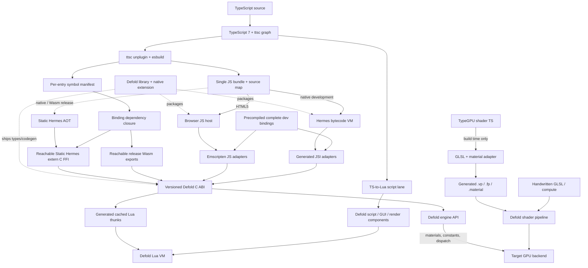

# Core shape



The TypeScript-facing contract is the product seam. Hermes, browser JavaScript,
JSI, Emscripten, and any initial Lua bootstrap are adapter details.

Development binaries contain the complete generated binding surface and never
invoke a native compiler on code edits. Release builds consume the bundler's
per-entry symbol manifest and generate only the reachable adapters. Types cover
the entire SDK in both modes; executable code remains pay-for-use.

This is intentionally a hybrid runtime, not a removal of Defold's Lua VM.
Authored `*.script.ts` components use generated sibling `.script` proxies to
retain Defold's native lifecycle, editor properties, factories, messages, and
instance semantics while gameplay state and behavior live in Hermes/browser
JavaScript. TS-to-Lua remains an optional migration/fallback lane.

Native modules sit beside the host contract. TypeScript looks them up through
`DefoldModules.getEnforcing<T>(name)`. Hermes receives objects containing JSI
host functions, so calls do not serialize through JSON; the browser adapter
installs ordinary JavaScript objects with the identical typed surface. The
production adapters should converge on a generated, versioned C ABI.

# Application lifecycle

The bundled application installs exactly one registration function on
`globalThis`. The host passes an API object and receives lifecycle hooks:

```ts
type DefoldApp = {
  init?(): void;
  update?(dt: number): void;
  onMessage?(message: HostMessage): void;
  final?(): void;
};

declare function defineDefoldApp(factory: (api: DefoldApiV1) => DefoldApp): void;
```

The registration boundary avoids runtime-specific module loading in the first
slice. Bundling resolves npm/ESM imports ahead of time.

# Host contract principles

* Version the contract from its first commit.
* Keep all runtime ownership and calls on Defold's engine thread initially.
* Copy strings and byte buffers at the boundary; never retain JSI values in
  Defold callbacks without an explicit rooting policy.
* Use opaque numeric handles for engine objects when richer APIs arrive.
* Return structured errors with code, message, and optional cause/stack.
* Make browser and native adapters pass the same contract suite.
* Prefer generated declarations and adapters once the schema stops moving.

# Native module evolution

The spike registers `ExampleMath.add(a, b)` to prove typed lookup and direct
native invocation. The production form should generate TypeScript interfaces,
JSI installers, argument validation, and browser shims from one schema. Its
public lookup semantics intentionally resemble React Native TurboModules, while
its static JSI binding direction resembles Nitro Modules. Defold owns runtime,
threading, object handles, and extension discovery; React Native is not a
runtime dependency.

# C ABI waist

One schema should generate the C ABI plus four projections: TypeScript types,
JSI installers for dynamic Hermes, Static Hermes `extern_c` declarations, and
Lua/Emscripten adapters. Static Hermes can call C APIs directly and can compile
the same application to native code or Wasm, which makes this ABI the stable
FFI seam rather than JSI itself. JSI remains the development/dynamic adapter;
the browser host reaches the ABI through Defold's Emscripten exports.

The current proof generates JSI installers, Emscripten adapters, Static Hermes
`extern_c` declarations, and direct SDK imports from `packages/bindings/modules.json`.
`ExampleMath` reaches a native C implementation directly. `Timer` reaches the
same C ABI first, then a second generated backend invokes cached Lua registry
references for APIs implemented only in Defold's Lua-facing layer.

# Native ownership

Start with one Hermes runtime per Defold application. It is created during the
extension's application initialization, binds the host API, evaluates the
bundle, and is destroyed at finalization. Per-collection/per-world runtimes are
a later isolation option and must be justified by measurements.

# HTML5 ownership

The browser owns the JavaScript runtime. In the current proof, the Defold Wasm
extension reads the archived application resource and asks its linked
Emscripten JavaScript library to evaluate and register it. The production
browser-host profile instead injects a content-hashed external script through
the HTML5 template, then uses an explicit registration/readiness handshake.
Both avoid VM duplication and keep browser DevTools, source maps, promises,
fetch, and web workers native.

Static Hermes can also AOT the application into the same Defold Wasm module.
That is an opt-in release experiment, not the default, and is blocked on exact
Defold exception/link compatibility plus size, performance, memory, and
language-compatibility gates.

# Shader lane

Shaders remain ordinary Defold assets: `.vp` vertex programs, `.fp` fragment
programs, reusable `.glsl` includes, and technical-preview `.cp` compute
programs. Modern source is SPIR-V-compatible GLSL and Defold owns its
cross-platform shader compilation. TypeScript/Lua bindings set material
constants, resources, and compute dispatches; neither Hermes nor the browser
adapter interprets shader source. The proposed TypeGPU lane is build-time only:
it adapts TypeGPU's experimental GLSL output into `.vp`, `.fp`, and `.material`
inputs, then leaves Bob, glslang, SPIR-V reflection, and Defold's cross-compilers
authoritative. See [TypeGPU shader authoring](research/typegpu-shader-lane.md).

# Evolution toward engine integration

The extension spike validates API design, packaging, lifecycle, error handling,
and cross-target parity cheaply. A first-class Defold resource/component would
later add editor/build-pipeline work: `.ts` resource recognition, dependency
analysis, collection lifecycle, live update, and debugger/editor integration.
That is a separate milestone, not a prerequisite for validating Hermes.
