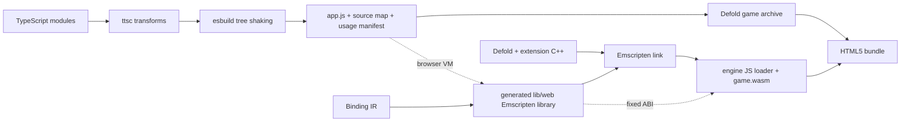
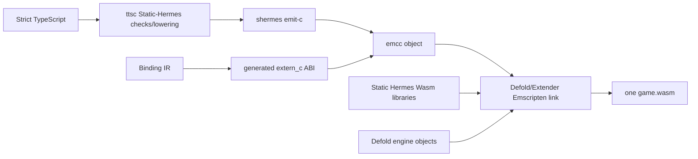

# Decision

Provide two HTML5 execution profiles behind the same generated TypeScript API
and conformance suite.

`browser-host` is the default. ttsc performs semantic transforms and esbuild
resolves, tree-shakes, and bundles the module graph as ordinary JavaScript. The
Defold engine remains one Emscripten-produced Wasm module. Generated Emscripten
JavaScript libraries expose direct, fixed-layout entry points between browser
JavaScript and that module. Hermes is not included.

`static-wasm` is an opt-in release experiment. Static Hermes emits C for the
strict application bundle, the matching Emscripten toolchain compiles it to an
object, and Extender links the object and required Static Hermes libraries into
the **same** Defold Wasm module. Generated `extern_c` imports then call the same
versioned C ABI used on native targets. Do not produce a second nested Hermes
Wasm VM or a second independently loaded application module unless isolation is
an explicit product requirement.

This is specifically the ordinary Defold extension path. The generated AOT C
unit is placed in the extension build payload, its Wasm-compatible Static Hermes
support archives are placed under `lib/wasm-web`, and the generated C++
`DM_DECLARE_EXTENSION` shell owns initialization and teardown. `shermes
-emit-c -exported-unit=deherm_app` produces a library-shaped `SHUnit` creator
named `sh_export_deherm_app` without a competing `main`; the shell creates the
runtime, calls `_sh_unit_init_guarded`, roots the registered lifecycle values,
and invokes them at Defold's safe lifecycle points. `npm run
check:static-hermes` reproduces this exact exported-unit shape against the
pinned compiler and asserts both the creator symbol and absence of `main`.

# Default browser-host pipeline



The current build emits an ES2020 IIFE because the archived resource is loaded
synchronously by the extension. `game.project` includes the generated
`/deherm/app.dehermc` resource. On initialization the HTML5
C++ extension reads those bytes with `dmResource::GetRaw`, then calls the linked
Emscripten library to install the generated modules and application lifecycle.
Extender discovers `.js` files under `lib/wasm-web` and the shared `lib/web`
directory automatically and passes them to Emscripten as `--js-library` inputs.

Emscripten library objects must contain link-time-serializable values. Debug
inspection therefore declares null slots for browser native functions and
`BigInt` bounds, then captures the pristine intrinsics at runtime immediately
before application evaluation. This both satisfies Emscripten's serializer and
prevents application code from substituting the inspection primitives. The
release runtime generator removes the debug capture and snapshot machinery.

The browser bootstrap now installs `DEFOLD_HERMES_SCRIPT_UNIVERSAL`, not the
legacy six-argument scalar provider. That generated provider projects the same
bounded recursive value graph used by native code directly into Wasm memory,
supports strings, arrays, records, maps, Defold POD values, URLs, retained
handles, and the 23 lifecycle-ledger callbacks that fit a generational
registry. Callback tokens use the same direct Wasm memory cells and a
fixed-capacity native trampoline; there is no Embind path. The bridge restores
scratch under bounded reentrancy, uses the caller's handle arenas for Matrix4
and URL callback values, normalizes signed Wasm callback token parts to u32,
and rejects cycles, stale tokens, or exhausted bounds. The canonical plan consequently emits 911 profile-available routes for
`browserWasmHost`: 888 non-callback routes plus 23 retained callbacks.
`socket.newtry` and `socket.protect` remain gated because they return Lua
higher-order closures with varargs/pcall semantics rather than registering an
engine callback. A fresh packaged HTML5 bundle of the War Battles port has since
executed that wider provider in headless Chrome; see
`.agents/docs/research/local-extender-runtime-evidence.md`.

# Browser component attachment

A bundle registers an application lifecycle, a component registry, or both.
`runtime.cpp` applies that rule for dynamic Hermes; the browser bootstrap now
applies the identical rule, so a component-only bundle such as the War Battles
port loads in the browser.

Defold's generated Lua component proxies run inside the Wasm engine while the
TypeScript component definitions run in the browser's own JavaScript engine.
`component_web_backend.cpp` implements the same `BackendApi` the Hermes backend
implements: it publishes the dispatching game object as the active
current-instance context, pushes the bounded script-adapter component context,
encodes the Lua `self`, editor properties, and lifecycle arguments into the
generated universal wire format, and calls the browser provider. That provider
owns a fixed-capacity generational slot pool of 1,024 instances, one `self`
object per live attachment, and decodes every value with the generated
`decodeWireRoots`, so the browser observes exactly the value shapes the native
runtime materializes. Encoding uses four static arenas, so a hook that
re-enters component dispatch gets its own frame and the fifth frame fails
closed.

The SDK's per-family browser gates were a pre-universal artifact. `callScriptApi`
dispatches one stable ID through a single bridge, and the browser bridge is the
generated universal direct-memory provider, so the specialized native POD and
fixed-tuple lanes being native-only never made a route unreachable in the
browser. Those two gates now carry no route. The one browser gate that remains
is machine-derived from the universal generator's own callback lifecycle
ledger, and it blocks exactly `socket.newtry` and `socket.protect`, whose
results are higher-order Lua closures.

The current spike evaluates the archived IIFE. That is acceptable for proving
the bridge but is not the final production loader because strict Content
Security Policy may reject dynamic evaluation. The production browser-host
profile emits `app.<content-hash>.js` as an external bundle resource and adds a
deterministic script/module tag through Defold's HTML5 template merge. The app
registers `globalThis.__defoldAppV1`; the Wasm engine waits for that registration
before invoking `init`. Development can serve the same artifact from a local
server and replace a runtime generation without relinking the engine.

# The browser has no Hermes, and the build must say so

Two consequences of the browser runtime having no Hermes are now enforced
rather than assumed.

**A typed-native unit cannot travel to a web target.** `shermes -emit-c` output
is a transport of the `hermes` runtime: the emitted C calls `_sh_*` entry
points that only `libhermes.a` defines. Bob discovers extensions by walking the
project and an `ext.manifest` cannot exclude a platform, so a unit a native
build materialised would otherwise be uploaded for `wasm-web` and fail the link
on undefined `_sh_ljs_create_environment`, `_sh_model_s22_p8_rel` and friends.
The build now decides this from pinned data and applies the decision to the
project before Bob walks it - a `.defignore` entry maintained by
`packages/cli/src/typed-native.mjs` - and the assembler refuses a non-Hermes
target with the machine-readable code `typed-native-requires-hermes-runtime`.
See the tooling note for the exact seams. Nothing is deleted: the same unit is
revealed again by the next Hermes-runtime build.

**Browser activation is implemented, through a different transport.** An HTML5
page exposes no Defold engine service, so a bundle cannot be posted to it as a
resource reload. `lib/web/library_defold_hermes.js` now installs
`globalThis.__defoldHermesDevV1` when the host loads, and its `activate`
performs the same transaction the native extension performs, in the same order:
evaluate the candidate, validate that it registered a lifecycle or a component
registry and carries its own 64-hex fingerprint, run the candidate's `init`,
*then* finalize the outgoing generation, and rebind every live component
attachment to the new definitions by id so the engine-side Lua proxies, their
`self` tables and their component ids survive. A candidate that throws leaves
the running generation active, and a component whose registered schema
fingerprint changed is refused rather than rebound, because a property-schema
change is a project build. Both outcomes log the same
`DEHERM_EVENT bundle-activated|bundle-rejected fingerprint=... initial=false`
line the native extension logs, so one parser serves both targets and a reload
that changed nothing is distinguishable from a real activation.

One difference is structural and is reported rather than hidden: the browser
host has exactly one JavaScript realm, so a candidate is evaluated in the same
global it replaces. Rollback restores the registered surface - app, component
registry, fingerprint - and cannot undo arbitrary global writes a failing
candidate performed on its way to failing.

**Telemetry is measured or named, never imitated.** The browser host reports
component instances, callback roots and their capacities, the engine's frame
delta where an application lifecycle is attached, and `performance.memory`
under its own `jsHeap*` names. The Hermes heap, the Lua handle registry and the
value bridge's arena high-water mark have no browser equivalent, and each is
returned with the reason it cannot be measured. `hermesHeapAvailable` is false
on this target and the console shows the gaps as gaps.

# Static Hermes fused-Wasm pipeline



Meta's checked-in helper proves the mechanical route: `shermes -emit-c`,
`emcc -c`, then link against the Emscripten-built Hermes libraries. The separate
Emscripten document states that this is not yet a fully integrated CLI path.
That helper builds an executable under Hermes's own flags; it does not prove a
library link into Defold.

The largest known blocker is the C++ exception-model mismatch. Defold's
`wasm-web` extension objects use `-fno-exceptions -fno-rtti` and the final link
sets `DISABLE_EXCEPTION_CATCHING=1`, while Hermes's API/JSI objects explicitly
enable exceptions and RTTI and `_sh_init` constructs a full JSI Hermes runtime.
Static Hermes's JS exception machinery uses setjmp/longjmp, which Defold's web
Lua build also uses and is therefore likely compatible, but that does not make
JSI C++ exceptions safe. The profile remains blocked until the exact emsdk 4.0.6
archive build and Defold link succeed and both a thrown JS exception and a JSI
C++ exception are exercised without aborting. Runtime/archive size is measured
at the same gate.

# Why browser-host remains the default

* It accepts the broadest TypeScript/npm/React surface and gives immediate
  browser DevTools, source maps, and fast refresh.
* TypeScript edits rebuild one JavaScript asset instead of a custom engine.
* It carries no second JavaScript runtime in the download or heap.
* Browser JIT versus Static Hermes Wasm performance is workload-dependent. The
  binding boundary can dominate engine-heavy code, while a browser JIT can win
  in JavaScript-heavy code.

The Static Hermes profile can win when a hot workload repeatedly crosses into
Defold: fusing generated code into the engine turns those calls into direct C
ABI calls inside one Wasm linear memory. It can lose through runtime/library
size, restricted language compatibility, GC/runtime costs, and slower builds.

# Shared ABI and memory policy

Both profiles consume the same binding IR and semantic overlay. Scalars use
direct calls. Struct arrays, transforms, vertices, messages, and other hot data
use generated structure-of-arrays or packed array-of-struct layouts in Wasm
memory. A frame scratch arena and generational handle tables eliminate
per-call allocation and stale-object reuse. Strings and variable payloads use
bounded UTF-8 scratch regions or explicit owned buffers. Embind, JSON, and
reflective name dispatch are forbidden on measured hot paths.

The browser-host adapter caches typed-array views and refreshes them only after
Wasm memory growth. The fused profile receives pointers directly. Both must
obey the same ownership, lifetime, bounds, and error contracts.

# Commands

The current local browser-host bundle path is:

```sh
npm run extender:prepare
npm run bob:web:bundle
```

`bob:web:bundle` selects `wasm-web`, generates the TypeScript bundle and web
bindings without packaging native Hermes archives, starts local Extender when
needed, and asks Bob to resolve, build, and bundle the game. The output is under
`build/bundle` according to the Bob wrapper configuration.

# Benchmark and promotion gates

Run browser-host and static-wasm from identical authored TypeScript and report:

1. compressed download size and Wasm/code split;
2. cold load, first frame, and time to interactive;
3. steady frame time distributions for JS-heavy and engine-call-heavy scenes;
4. JS heap, Wasm committed memory, peak memory, and growth events;
5. calls per frame and nanoseconds per scalar, handle, string, and bulk ABI call;
6. allocation counts after warm-up and callback/handle leak checks;
7. full API conformance results and retained npm/React compatibility;
8. incremental development build and release build duration.

Promote Static Hermes for HTML5 only when it wins a named release workload by a
material threshold without failing compatibility, size, memory, debugging, or
build-time budgets. Profile selection is per build, never an undocumented
semantic fork.
