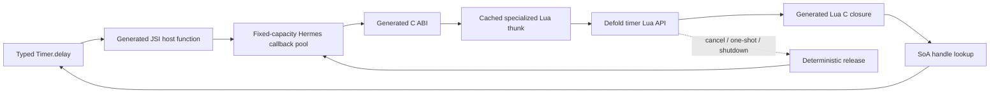

# Decision

Lua-only compatibility is a generated backend behind the same typed API, not a
generic runtime serializer. At extension initialization it resolves each
reachable `module.function` once and stores an integer Lua registry reference.
Generated hot thunks fetch that reference numerically, push statically known
arguments, call Lua, read statically known results, and restore the exact stack
top on every success or failure path.

The current vertical slice maps `Timer.delay`, `Timer.cancel`, and
`Timer.trigger` through the real Lua module shape. Its standalone harness
compiles Defold's pinned Lua 5.1 sources, checks stack balance and error
propagation, and asserts zero steady-state Lua allocator calls after warm-up.
The native end-to-end test additionally proves Hermes JavaScript callback
capture, generated JSI lowering, the C ABI, Lua closure re-entry, and
deterministic callback release.

# Memory and layout rules

1. Primitive arguments and results live in generated C++ stack locals. They do
   not enter a variant, tuple, heap box, JSON buffer, or scratch arena.
2. Variable-length temporary data uses one runtime-owned bump arena. Each call
   takes a mark and rewinds it on exit. Exhaustion is an explicit error; there
   is no hidden heap fallback.
3. Cross-frame Lua objects and callbacks use fixed-capacity generational handle
   storage. The pool is structure-of-arrays: Lua state, payload/ref, runtime,
   type, generation, state, and free-list links are separate contiguous arrays.
4. Acquire and release are O(1). Recycled slots increment their generation so a
   stale JavaScript wrapper cannot alias a new object.
5. Finalizers only mark a live slot queued in a fixed ring. The engine thread
   drains releases at a safe frame boundary. Explicit disposal remains the
   primary path, and runtime teardown sweeps all remaining slots.
6. Pool and arena capacities are chosen at runtime creation, reported through
   statistics, and never grow during gameplay. High-water and exhaustion
   counters make tuning observable.
7. Known records receive generated field push/read code. Arbitrary or cyclic
   tables remain rooted handles rather than recursively allocated copies.

# Instance and stack discipline

Defold exposes the extension Lua state, but modules such as `timer`, `go`, and
`sprite` also read the current script instance. The extension therefore ships a
generated gameplay-free companion script. Its `init(self)` calls
`_deherm_.attach(self)`, which roots the instance and starts the TypeScript
application. Each compatibility call saves the previous current instance,
installs the captured instance, invokes the cached function, restores the old
instance, and resets the stack.

The TypeScript runtime is loaded before attachment but its `init` hook is
deferred until the companion supplies a valid instance. This makes an
instance-dependent call from TypeScript `init` valid without hand-authored Lua
game logic.

# Performance gates

The backend must maintain separate evidence for:

* cached-ref primitive calls;
* fixed-layout vectors, quaternions, URLs, and hashes;
* strings and spans through scratch storage;
* callback creation, steady callback dispatch, cancellation, and teardown;
* direct C ABI versus Lua compatibility implementations of the same operation.

Every benchmark reports warm distribution, allocator calls, arena high-water,
pool high-water, and stack balance. A faster average is insufficient if it
introduces unbounded allocation or tail-latency spikes.

# Callback ownership

`timer.delay` uses a generated Lua C closure that forwards
`(self, handle, elapsed)` into a rooted Hermes/Static Hermes callback. One-shot
callbacks release after their first dispatch attempt; repeating callbacks release on successful
cancel, instance teardown, or runtime sweep. The timer-to-callback association
uses a fixed-capacity open-addressed table, and the native JavaScript functions
live in a fixed-capacity generational pool. The steady callback benchmark runs
100,000 dispatches at roughly 0.39–0.43 microseconds/call with zero Lua
allocator calls; the cached primitive path runs one million calls at roughly
0.18–0.21 microseconds/call on the local arm64 macOS release build. These are
directional local measurements, not universal device budgets.
