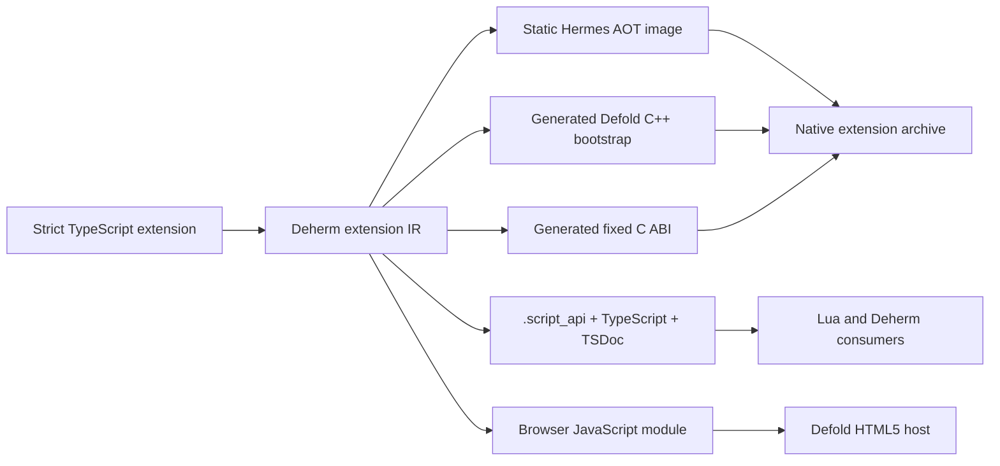

# Intent

After the core Defold API reaches compiled and conformant coverage, Deherm
should let an npm package define a Defold extension primarily in strict
TypeScript. Static Hermes AOT owns the native implementation logic. Generated
C/C++ remains the narrow host shell required by Defold's extension lifecycle,
linker, and script registration contracts.



The TypeScript authoring API should be declarative and statically analyzable:

```ts
export default defineExtension({
  name: "dense-ecs",
  init(context) {
    world = new World(context.memoryBudget);
  },
  update(context, deltaSeconds) {
    world.step(deltaSeconds);
  },
  api: {
    createEntity,
    destroyEntity,
    queryPositionBatch,
  },
});
```

This syntax is illustrative, not yet a supported API.

# Generated package contract

One canonical semantic IR generates:

* the Static Hermes entry module and release AOT inputs;
* the minimal Defold `DM_DECLARE_EXTENSION` bootstrap and lifecycle forwarding;
* fixed-width C ABI imports/exports with explicit ownership and error results;
* direct Deherm TypeScript clients, `.script_api` metadata, Lua registration,
  TSDoc, and VS Code project data;
* the HTML5 JavaScript implementation using the same stable binding IDs and
  memory-layout schemas;
* extension discovery metadata so downstream projects can merge, cache,
  tree-shake, and regenerate against the package;
* target manifests, link inputs, capability requirements, and conformance
  status per exported symbol.

The generated bootstrap is not considered handwritten extension logic. It is a
small, audited ABI boundary analogous to generated Swift/Objective-C, JNI, or
NativeAOT host glue.

# ECS proving project

A data-oriented ECS is the preferred first extension because it tests the
architecture without making FFI overhead the design center. Entity generations,
component masks, and component columns remain in dense Static Hermes-owned
storage. Systems operate over batches inside the AOT module. Only lifecycle,
resource access, registration, diagnostics, and deliberately exposed batch
views cross the C ABI.

The example must not expose one native call per component access. Its public API
uses handles, bulk spans, and query/result layouts whose ownership and frame
lifetime are generated. Native and browser implementations consume the same
layout manifest.

# Required validation before acceptance

This remains a proposal because the repository currently proves Static Hermes
typed `extern_c` imports, not a complete Defold lifecycle calling into an AOT
extension module. Acceptance requires an end-to-end spike that:

1. compiles a strict TypeScript lifecycle module to the pinned Static Hermes
   native output;
2. links it with the generated Defold bootstrap and invokes `init`, `update`,
   and `finalize` from a host harness;
3. proves exported extension functions are callable from Deherm, Lua, and the
   HTML5 projection with matching behavior;
4. reports runtime/GC ownership, thread affinity, allocator use, teardown, and
   binary-size costs;
5. rejects unsupported TypeScript with source-mapped diagnostics;
6. packages as an ordinary Defold library/native extension without an engine
   fork; and
7. lets a downstream generated project discover its metadata from npm and a
   Defold dependency without handwritten binding configuration.

The core full-API compiler remains the prerequisite. The extension SDK reuses
its semantic tokens, layouts, target projections, memory policy, and
conformance ledger rather than creating a parallel binding system.
