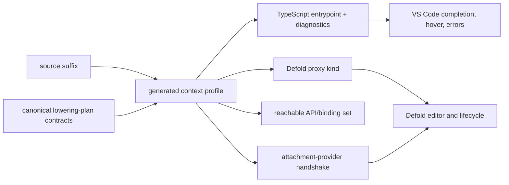

# Decision

The authored filename declares the Defold execution context. The declaration is
not a hint: the generator, TypeScript checker, VS Code language service, bundle
planner, generated proxy, and runtime attachment handshake must all consume the
same generated context record.

| Authored source | Generated Defold resource | Execution context | Exclusive API |
| --- | --- | --- | --- |
| `player.script.ts` | `player.script` | game-object script instance | game-object instance operations |
| `hud.gui.ts` | `hud.gui_script` | GUI script instance and GUI scene | `gui.*` |
| `main.render.ts` | `main.render_script` | render script instance and graphics context | `render.*` |
| `damage.ts` | none | context-free shared module | no instance-exclusive API |

The suffix table is data owned by the generator. Adding another attachment kind
must add one table row and a provider implementation; it must not introduce a
second collection of hand-maintained API names.



# Type-checking contract

Project generation emits a solution configuration plus generated context
projects for shared, game-object, GUI, and render sources. Each context project
maps the public project SDK import to a generated context entrypoint. The
entrypoint is projected from the canonical lowering plan, so it omits APIs whose
required context is incompatible with the source suffix.

The minimum compile-time matrix is:

```ts
// hud.gui.ts: accepted
import { gui } from "@deherm/project";
gui.getNode("score");

// player.script.ts: rejected; `gui` is not exported in this context
import { gui } from "@deherm/project";

// main.render.ts: accepted
import { render } from "@deherm/project";
render.draw(/* generated predicate type */);

// damage.ts: rejected; shared modules cannot capture an instance API
import { render } from "@deherm/project";
```

The generated solution must type-check all four projects in one command. The
same partition must be visible in VS Code, not merely in a command-line build.
Context entrypoints provide ordinary TypeScript errors and completion filtering.
The generated project references also reject direct cross-context source imports
and expose no wildcard alias to the unfiltered SDK. The projects discover
suffix resources anywhere under the Defold project, not only under `src/`, while
excluding dependency/build caches. The command-line boundary pass rejects
direct, aliased/deep, normalized-relative, and shared-barrel routes into the
unfiltered generated or package-root SDK. A future déherm TypeScript
language-service plugin can provide richer use-site diagnostics, but it is not
part of the current correctness claim.

Cross-context source imports fail unless the imported file is context-free. A
plain `*.ts` module may contain algorithms, data, and functions whose required
engine services are passed explicitly, but it cannot import GUI, render, or
game-object-instance APIs. This keeps reusable code reusable and prevents a
shared helper from acquiring whichever context happened to compile it first.

The implemented command-line gate is:

```sh
npx deherm generate
npx deherm typecheck
```

`typecheck` runs the generated four-project solution with the package-local
TypeScript compiler. When a project already owns `tsconfig.json`, generation
preserves it; the explicit command remains authoritative until that project
chooses to reference `tsconfig.deherm.json`. Automatic VS Code association for
such custom roots and the matching use-site language-service plugin remain open.

# Generator authority

API availability comes from each script route's execution-context contract in
the canonical lowering plan. Source-backed semantic policies normalize concrete
tokens such as `gui-scene`, `active-gui-scene`, and
`captured-gui-script-instance` into the GUI capability, and the corresponding
render tokens into the render capability. Unknown context tokens remain visible
in generator diagnostics. The current canonical plan contains 347
`context-policy-unresolved` routes; the generated manifest labels them
`provisionally-visible-in-all-authored-contexts` rather than claiming they are
global. Resolving those semantic contracts is required before strict context
completeness can be claimed.

Defold's own guards validate the two important exclusive contexts. GUI functions
check for the GUI script instance and report that `gui.*` is available only from
a `.gui_script`; render functions perform the corresponding check for a
`.render_script`. The TypeScript restriction therefore predicts an engine error
rather than inventing a language-only limitation.

The context manifest records at least:

```text
source suffix
proxy suffix and proxy kind
context capability ID
allowed route stable IDs
required attachment-provider ID
property-schema support
input hashes and generator version
```

The generated manifest records the Defold revision, authenticated schema-v2
canonical plan plus its generator sentinel, project extension inventory, suffix
table, and output sentinels. `generate` derives a key from those inputs and its
own implementation and performs no writes when the manifest/lock sentinel pair
already names that key. `generate --force` rebuilds disposable generated output;
`verify-generated` performs the explicit full integrity audit.

# Runtime and proxy contract

The generated Lua proxy contract captures the real Defold instance for its
resource kind, then requires a TypeScript component attachment provider:

* `ScriptAttachment` restores the game-object script instance;
* `GuiScriptAttachment` restores the GUI script instance and validates GUI
  handles against the active scene;
* `RenderScriptAttachment` restores the render script instance and carries the
  graphics context and render-resource lifetime policy.

Every API descriptor carries its required context capability. The provider must
compare that capability with the attachment handshake before touching Lua or
native engine state. Compile-time visibility is DX; this runtime comparison is
the eventual correctness boundary for generated code, dynamic loading, and stale
bundles.

The provider is not implemented yet. The extension currently installs all six
generated proxy Lua names from a generated capability report and makes each one
raise the same deterministic error. This is a fail-closed gate, not an execution
stub. The report records zero executable methods and names the missing component
registry, generational instance pool, reentrant context selection, editor
property codecs, and bounded message/input codecs.

Only `*.script.ts` supports generated Defold script properties. The pinned
Defold compiler accepts `go.property()` declarations in `.script` resources;
GUI and render context sources therefore fail generation if they declare that
property schema until Defold exposes an equivalent resource contract.

# Verification gate

The context feature is complete only when generated tests prove all of these:

1. positive TypeScript fixtures for each source suffix;
2. negative fixtures for every cross-context API pair;
3. plain shared files reject all instance-exclusive APIs even when imported by
   a context file;
4. each authored suffix generates the exact Defold proxy suffix and manifest
   capability;
5. mismatched runtime attachment handshakes fail before engine invocation;
6. one packaged Defold fixture executes a real call in each of the game-object,
   GUI, and render contexts;
7. VS Code uses the same diagnostics and completion set as the command-line
   checker.

Generated types and proxy goldens prove projection only. They do not prove the
GUI or render engine call until the corresponding attachment provider is linked
and the packaged-engine fixture has executed it.
