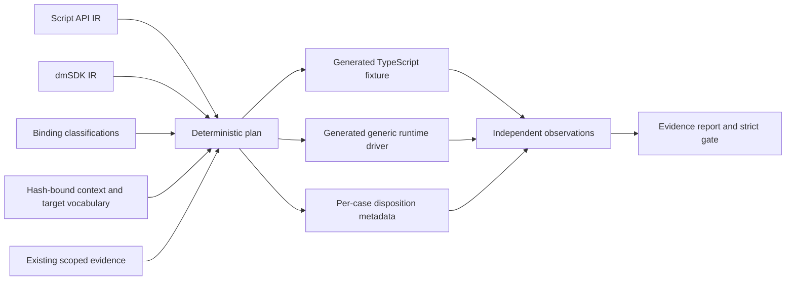

# Purpose

The conformance harness turns the generated API inventories into a test plan
without hand-authoring thousands of calls. Every Defold script function and
every dmSDK declaration receives a stable case ID, TypeScript access path,
target and context requirements, execution safety policy, stage disposition,
and semantic-conformance state.

The plan is intentionally honest about evidence. Generating a fixture is not
proof that it compiled; classifying an adapter is not proof that it linked;
linking is not proof that a call executed; and execution is not semantic
conformance. Observations are captured separately and merged into a report.



# Commands

Generate the entire current surface for a macOS arm64 engine fixture:

```sh
deherm conformance generate \
  --output build/conformance/macos-all \
  --target arm64-macos \
  --context '*' \
  --shard 0/1
```

Generate one stable browser shard:

```sh
deherm conformance generate \
  --output build/conformance/web-3 \
  --surface script \
  --target js-web \
  --context browser,engine \
  --shard 3/16
```

Compile the emitted type fixture and produce one plan-bound observation per
selected binding:

```sh
deherm conformance compile \
  --plan build/conformance/macos-all/plan.json \
  --output build/conformance/macos-all/compile-observation.json
```

Merge observations and require every selected mandatory stage to have a fresh
passing observation:

```sh
deherm conformance report \
  --plan build/conformance/macos-all/plan.json \
  --observation build/conformance/macos-all/compile-observation.json \
  --observation build/conformance/macos-all/runtime-observation.json \
  --output build/conformance/macos-all/report.json \
  --strict
```

`--shard` uses zero-based `INDEX/COUNT` syntax. Assignment is the persistent
32-bit binding ID modulo `COUNT`, not array position, so generator ordering
does not move a case between shards. The plan rejects duplicate canonical IDs
and stable-ID collisions.

# Generated files

| File | Role |
| --- | --- |
| `plan.json` | Complete selected case metadata, input hashes, stage dispositions, contexts, target, and summaries |
| `conformance.schema.json` | JSON Schema for plans, observations, reports, stage dispositions, execution policies, and semantic states |
| `compile.ts` | One generated TypeScript type access per selected binding, including parameters and result types for callable APIs |
| `runtime.mjs` | Generic safe-case runner driven by case metadata and a target adapter |
| `observations.example.json` | Empty, plan-bound observation envelope |
| `tsconfig.json` | Strict no-emit compiler configuration for the generated fixture |

The plan's context and target gates come from the semantic-policy
`conformanceVocabulary`, not from module-name or platform-name heuristics in
the CLI. The lowering-plan generator carries the normalized rows and exact
generated target census with both the semantic-policy and target-conditional
input hashes, plus a vocabulary digest; conformance refuses a plan whose rows
or target/group mapping are not hash-bound. Context rows may name a future
module explicitly, while target rows use exact target IDs or the authenticated
target-conditionals group from that same plan (so a target rename does not
silently change availability). A declaration
with no matching row receives the conservative `generic` context, and a
platform-gated declaration with no availability row is blocked with an
explicit reason.

The current full plan selects 926 script functions and 2,140 dmSDK
declarations: 3,066 cases. The test suite compiles that generated file against
the actual generated SDK. This catches translation drift in nested names as
well as missing functions, types, variables, and declaration metadata.

The current runtime plan links 93 script calls (90 generated scalar-dispatch
descriptors plus 3 specialized timer bindings); the safe arm64 macOS selection
marks 83 executable and 10 linked but policy-blocked. It also links 26 generated
scalar dmSDK thunks. The 90 scalar script cases are deliberately
`semantic: unverified`: descriptor generation and generic dispatch prove that
they can be routed, not that each function behaves correctly in its required
engine context. Real-target observations promote individual cases only after
the engine executes a generated fixture and its oracle passes.

The pinned arm64 macOS plan currently annotates 12 cases selected by the
descriptor-validated native probe manifest (14 calls because two bindings have
two semantic shapes). Selection is not silently promoted into an observation:
the runtime verifier must still launch Defold and match every oracle marker.
Other conformance targets do not inherit the macOS selection.

# Disposition model

Each case has independent stages:

| Stage | States | Meaning |
| --- | --- | --- |
| compile | `compile-only`, `skipped-with-reason` | The TypeScript surface can be resolved and its argument/result types instantiated, or a specific reason prevents it |
| link | `linked`, `skipped-with-reason` | An adapter has scoped link evidence, or the exact missing adapter/policy is recorded |
| runtime | `executable`, `skipped-with-reason` | The generated driver may invoke the case in this selection, or records why it may not |
| semantic | `unverified`, `host-conformant`, `target-conformant`, `blocked`, `not-applicable` | The scope of behavioral evidence, kept separate from mere execution |

Execution policy is also independent:

- `safe` cases may run automatically when the target adapter supplies a
  fixture.
- `destructive` cases require an isolated disposable project or resource.
- `interactive` cases require an OS surface or human/input automation.
- `context-blocked` cases do not match the selected engine context or target.
- `not-applicable` covers type metadata and other non-executable declarations.

This separation matters. A timer binding can be executable and
host-conformant while still lacking target conformance. A platform-gated API
can have a complete TypeScript surface while being context-blocked for the
selected target. A dmSDK type is compile-only and semantic conformance is
properly not applicable.

# Runtime adapter contract

The generated runtime driver owns iteration and invocation selection. A
target adapter supplies only context-specific fixtures and the generic bridge:

```js
const adapter = {
  async fixtureFor(testCase) {
    // Look up generated/scenario data by stable testCase.id.
    // Return undefined when the required engine fixture is unavailable.
    return {
      args: scenario.arguments,
      evidence: scenario.evidence,
      assert(actual) {
        return scenario.oracle(actual);
      }
    };
  },

  async invoke(invocation, args) {
    if (invocation.kind === "script") {
      return scriptBridge.call(invocation.modulePath, invocation.member, args);
    }
    return dmSdkBridge.call(invocation.symbol, args);
  }
};
```

No individual API invocation is hand-coded. Engine-state construction and
semantic oracles remain explicit because inventing valid physics bodies, GUI
scenes, network peers, resource factories, native pointers, or destructive
lifecycle state from a type signature would create false tests. Scenario
providers should be generated from reusable context recipes and keyed by the
canonical binding ID.

# Observation integrity

An observation is bound to both `planId` and target. The plan ID hashes the
selection and all semantic generator inputs. Reports reject unknown cases,
duplicate observations for the same case/stage, schema mismatches, plan
mismatches, target mismatches, and invalid status values.

Baseline evidence imported from existing generated metadata is always scoped,
for example `host-source` or `host-e2e`, and never appears as a fresh passing
observation. Without observation files, a report correctly says every stage
is `not-run`, even if its plan records prior scoped evidence. `--strict` fails
until every selected compile stage, every planned linked stage, and every safe
planned executable stage has a passing observation.

# Next conformance wave

Generate reusable scenario providers for engine contexts rather than binding
names: application lifecycle, extension lifecycle, game object, GUI scene,
render script, physics world, network, window/input, browser, and isolated
destructive state. Then teach the build runners to emit compile and link
observations automatically and the Defold test collection to emit runtime and
semantic observations. Cross-target promotion should occur only when the same
canonical case receives target-scoped evidence.
