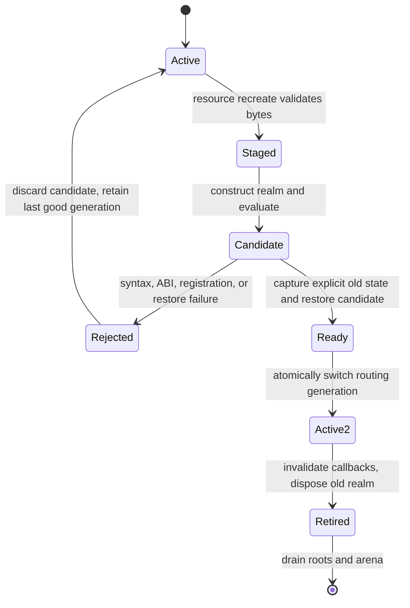

# Result

Defold already supplies a usable native hot-reload transport. In a debug engine,
the editor rebuilds project resources, serves the changed artifacts over its
build HTTP server, and sends the running target a DDF `Resource.Reload` message.
The resource factory fetches and recreates each already-loaded resource at the
start of an engine frame. A custom `dehermc` resource type now uses this path to
stage a new dynamic-Hermes bundle. The extension constructs and initializes a
candidate runtime before replacing the active generation. A real Defold 1.14.0
debug-engine test has reproduced generation 1, changed the served resource,
posted the exact reload DDF, committed generation 2, and executed the changed
TypeScript result (`module:84`).

`deherm dev` should therefore be a headless daemon/controller first and a Rezi
operator console second. The console observes and commands that controller; it
must not own watchers, compiler processes, transports, or runtime state. The
published Rezi beta is suitable for the visual layer if exact-version pinned and
kept replaceable.

This note separates behavior reproduced in the pinned Defold and Rezi sources
or the local engine harness from design proposals that still require
implementation and on-device proof.

# Verified Defold behavior

## The editor-to-engine path

```mermaid
flowchart LR
  TS[generated app.dehermc on disk] --> SYNC[editor disk sync]
  SYNC --> BUILD[project build and ETag comparison]
  BUILD --> SERVE[editor /build resource server]
  BUILD --> POST[POST /post/@resource/reload]
  POST --> QUEUE[engine resource socket queue]
  QUEUE --> FRAME[UpdateFactory at next frame]
  FRAME --> FETCH[fetch changed artifact from resource.uri]
  FETCH --> RECREATE[resource Recreate callback]
  RECREATE --> STAGE[Deherm candidate generation]
  STAGE --> COMMIT[frame-safe validate and atomic commit]
  COMMIT --> ACK[structured activation event]
  ACK --> TUI[deherm dev controller and Rezi view]
```



1. The editor's hot-reload command performs a project build even for a resource
   subset, specifically to keep its build cache consistent. It compares build
   resource ETags and selects changed resources that the target already knows
   about. See `editor/src/clj/editor/app_view.clj:1717-1758`.
2. For each selected or launched target, the editor serializes
   `dmResourceDDF.Resource.Reload { resources: [...] }` and sends it as the body
   of `POST <target>/post/@resource/reload`. See
   `editor/src/clj/editor/engine.clj:57-69` and
   `engine/resource/proto/resource/resource_ddf.proto:7-10`.
3. The engine HTTP service derives the target socket and DDF type from the URL,
   decodes the body, and enqueues a Defold message. Its request buffer is 1,024
   bytes in this revision. An HTTP `200 OK` means the message was accepted for
   posting, not that any resource was successfully recreated. See
   `engine/engine/src/engine_service.cpp:128-175`.
4. The resource socket drains reload messages and calls `ReloadResource` for
   each path. See `engine/resource/src/resource.cpp:381-417`.
5. `dmResource::UpdateFactory` runs near the beginning of each engine frame,
   before extension update callbacks and before game-object update. This is a
   useful safe point, but the resource recreate callback itself must remain
   bounded. See `engine/engine/src/engine.cpp:2024-2046` and `:2084-2089`.

## What the resource factory guarantees

At the pinned revision, reload succeeds only when all of the following hold:

* The path already exists in the resource factory. A reload message does not
  create an arbitrary new loaded resource.
* Its registered type has a recreate callback.
* The new bytes can be fetched from the active resource provider.
* The recreate callback succeeds.

On success, the factory increments the resource version, invokes registered
reload callbacks, and destroys `m_PrevResource` when the recreate operation
provides one. See `engine/resource/src/resource.cpp:1089-1207`.

Resource reload support is enabled only when Defold is in debug mode; the engine
sets `RESOURCE_FACTORY_FLAGS_RELOAD_SUPPORT` conditionally at
`engine/engine/src/engine.cpp:1360-1370`. Shipping builds must not depend on this
development facility.

The public dmSDK exposes both reload listeners and custom resource-type create,
destroy, preload, and recreate callbacks. Its recreate contract explicitly
warns that outstanding pointers to a resource may exist, so a custom type must
replace data safely rather than invalidate consumers in place. See
`engine/resource/src/dmsdk/resource/resource.h:138-168`, `:457-593`, and
`:695-755`.

The current Deherm application is copied as a `custom_resources` file named
`/deherm/app.dehermc`, registered through `DM_DECLARE_RESOURCE_TYPE`, and loaded
with `dmResource::Get`. Its stable resource object owns the bytes and generation
counter. The recreate callback allocates and copies candidate bytes before
swapping them into the resource; allocation failure leaves the committed bytes
and generation unchanged.

## Lua script instance semantics

The official manual and pinned source agree on this behavior:

| Reloaded item | Verified outcome |
| --- | --- |
| A `.script` resource attached to an existing component | Defold re-executes the script source, replaces lifecycle function references, retains the existing script instance and its `self` table, does not call `init()`, and calls the new `on_reload(self)`. |
| A required Lua module | The module source is re-executed. Globals can reflect the update, but callers holding a previously returned local table do not automatically receive a replacement table. |
| A game-object prototype | Defold may finalize/destroy and recreate the game object. Do not generalize script-component state retention to prototype reload. |
| A native extension binary | Not a resource-generation swap. It requires a custom-engine rebuild and process restart. |

The script resource reloads its Lua chunk and properties in
`engine/gameobject/src/gameobject/res_script.cpp:95-132`. Lifecycle references
are replaced by `LoadScript` at
`engine/gameobject/src/gameobject/gameobject_script.cpp:2453-2508`. The existing
component's script instance and data table are passed into `on_reload` at
`engine/gameobject/src/gameobject/comp_script.cpp:788-812`. Lua-module reload is
implemented at `engine/script/src/script_module.cpp:154-197`. Prototype-specific
recreation appears at `engine/gameobject/src/gameobject/gameobject.cpp:4300-4377`.

For generated `.script` proxies, this means Defold's Lua `self` and game object
can remain stable while Deherm replaces a Hermes application generation. Any
TypeScript component object, closure, promise, timer, or JSI value belongs to
the old Hermes realm and does not survive automatically.

## Remote targets

Defold debug engines publish an mDNS `_defold._tcp.local` service. Its metadata
includes the engine id, name, log port, version, platform, SHA-1, and schema.
The engine service normally starts on port 8001 or chooses a dynamic port; the
log service is also dynamic. See `engine/engine/src/engine_service_discovery.cpp`
and `engine/engine/src/engine_service.cpp:252-400`, summarized in the pinned
`engine/docs/DEBUG_PORTS_AND_SERVICES.md:3-56`.

When running on a remote device, the editor reboots the target with
`--config=resource.uri=http://<editor-address>:<editor-port>/build` and the
compiled `game.projectc` URL. The address is chosen so the device can reach the
editor host. See `editor/src/clj/editor/engine.clj:104-129` and
`editor/src/clj/editor/app_view.clj:776-777`. The editor serves artifacts with
ETags at `editor/src/clj/editor/hot_reload.clj:24-68`; Defold's HTTP resource
provider performs synchronous fetches and handles ETags/304 at
`engine/resource/src/providers/provider_http.cpp:136-335`.

The editor also exposes a useful integration seam. It writes its loopback port
and token under `.internal/editor.port` and `.internal/editor.token`, and
`POST /command/hot-reload` first syncs changed disk resources before invoking
the normal reload command. The endpoint is at
`editor/src/clj/editor/command_requests.clj:340-348`; startup files are written
at `editor/src/clj/editor/boot_open_project.clj:231-272`. Console history and a
streaming feed are exposed at `editor/src/clj/editor/console.clj:880-922`.

In this pinned source, the hot-reload handler itself does not call the same
authorization guard used by `/bob`. That observation is version-specific, not
a public security contract. `deherm dev` must bind its own services to loopback
by default, must not expose editor tokens in logs, and must treat editor command
and console endpoints as optional adapters with a version check.

## Hot reload is not Live Update

Defold Live Update is the shipped-game mechanism for packaging content outside
the initial application and downloading or mounting it later. It is not the
edit-time resource-reload protocol, does not replace a native extension binary,
and should not be used as the name for this feature. The two paths may later
share signed bundle artifacts, but they have different lifecycle and trust
models.

# Implemented native reload floor and proposed complete transaction

The typed resource, direct DDF transport, local resource server, and native
dynamic-Hermes generation swap have running-engine evidence. State
capture/restore, schema migration, browser-host activation, target discovery,
structured activation telemetry, and soak/leak certification remain open.

## Typed bundle resource

The implementation registers `.dehermc` and loads `/deherm/app.dehermc` with
the typed resource API so Defold tracks it. The current proof artifact is
JavaScript source plus a deterministic fingerprint; the production envelope
should contain:

* magic, format version, flags, and bounded section table;
* monotonically increasing build generation and content digest;
* exact Defold SHA, Hermes ABI/version, target, profile, and binding-schema hash;
* source or matched Hermes bytecode plus composed source map;
* component-registration and property-schema digests;
* optional state-migration id, never an unserialized JSI value or native pointer.

The resource object's address stays stable. `Recreate` allocates and copies the
candidate bytes before swapping them into the committed vector and incrementing
the resource generation. Runtime evaluation happens afterward in the extension
update, never in the resource callback. The bounded inactive-generation arena
and envelope validation are not implemented yet.

## Generation transaction



The transaction is:

1. Build a candidate Hermes runtime in an inactive runtime slot.
2. Evaluate the complete bundle and validate exported lifecycle/component tables.
3. Ask the active generation for a non-destructive, bounded serializable state
   snapshot. Restore that snapshot into the candidate. A raw Hermes object graph
   is never shared between realms.
4. At a frame boundary, atomically switch the active runtime id, bundle slot,
   dispatch tables, and component-generation routing.
5. Reject late callbacks from the old generation, invoke its `dispose`/`final`,
   drain roots and deferred releases, and reset its arenas.

This deliberately separates `capture()` from `dispose()`: a candidate failure
must leave the previous generation running. Existing Defold game objects and
Lua proxy `self` tables can survive. The proxy stores stable ids; generated
TypeScript component instances are reconstructed/rebound and may restore
explicit per-instance state. A proxy property-schema change takes the slower
editor build/reload path and may require a declared migration or reset.

Dynamic source or matched bytecode Hermes is the native development lane.
Static Hermes is still the native release/AOT lane, but an AOT binary cannot be
replaced by resource reload. HTML5 uses the host browser JavaScript engine and a
unique generation factory; it does not embed Hermes in Wasm by default.

## Two native transports and one browser transport

The first implementation should support:

1. **Editor adapter.** Watch and compile, write the generated `.dehermc` inside
   the project, detect `.internal/editor.port`, call the editor hot-reload
   command, and consume the editor console stream. This reuses Defold's build
   cache, resource server, remote-target selection, and exact protocol.
2. **Standalone adapter.** Own a content-addressed `/build` HTTP server, discover
   a debug target through mDNS or `--target host:port`, reboot/launch it with the
   same `resource.uri` shape used by the editor, and send the standard DDF
   `Resource.Reload` POST directly. This requires a real interoperability test;
   generated protocol code or a tiny verified encoder is preferable to a
   hand-maintained payload.
3. **HTML5 adapter.** A browser page cannot expose the native engine service.
   Connect outward to the local daemon with loopback WebSocket/SSE, transfer the
   envelope, validate it, and run the same candidate/commit/rollback lifecycle.

Because the native engine responds before actual recreation, the controller
must wait for a structured `DEHERM_EVENT` activation or rejection event carrying
the build id, runtime generation, resource version, duration, and reason. The
first version can parse this from the Defold log service/editor console; a
length-prefixed telemetry channel can follow. HTTP success is never shown as a
successful activation.

# Rezi decision

The library the user means is
[`RtlZeroMemory/Rezi`](https://github.com/RtlZeroMemory/Rezi), a TypeScript TUI
framework for Node and Bun with `@rezi-ui/core`, `@rezi-ui/node`, an optional
native Zireael renderer, and test support. It is Apache-2.0 licensed. Its model
is a pure view over application state with `ui.*` widgets and support for
layouts, panels, tables, virtual lists, trees, logs, charts, forms, overlays,
and keybindings. That is a good match for an operator console.

The registry and repository do not currently name the same release:

* npm `latest` for `@rezi-ui/core`, `@rezi-ui/node`, and `@rezi-ui/native` was
  verified as `0.1.0-beta.2` on 2026-09-17. The package metadata requires Node
  18+ or Bun 1.3+ and declares Apache-2.0.
* Repository main at verified commit
  `671a8a2600e5686316e0f124b316b669b33c8654` is prepared as beta.3. APIs present
  only there, including newer inline-terminal helpers, are not published API.
* Rezi describes itself as beta. Its prebuilt native packages cover macOS
  x64/arm64, Windows x64/arm64, and glibc Linux x64/arm64; Alpine/musl is not a
  supported prebuilt target.

Adopt Rezi behind a `DevView` port, pin all published packages to the exact same
beta.2 version, and do not import it when stdin/stdout are not terminals. Every
operation must remain available through a plain line-oriented UI and stable
`--json` event stream. This makes CI, editor integration, accessibility, logs,
and a future TUI replacement independent of Rezi. Repository-only beta.3 APIs
may be used only after a published release or an explicit maintained fork.

Rezi/Zireael performance statements are upstream claims, not Deherm evidence.
Before making it the default interactive view, benchmark idle CPU, key-to-paint
latency, resize behavior, 10,000-line log ingestion, RSS growth, and install
fallbacks on each supported Deherm host.

## Implemented console shape

The operator console is now declarative rather than a fixed grid of static
text. `packages/cli/src/dev/tui/` is authored in TSX against `@rezi-ui/jsx`
(pinned to the same `0.1.0-beta.2` as core and node), imported through an
esbuild module hook registered by `packages/cli/src/dev/tsx-loader.mjs`. esbuild
is already a first-class dependency of the compiler pipeline, so the published
package gains no new toolchain and no build step.

Four properties follow from making every panel wrap exactly one focusable Rezi
widget rather than drawing text:

* **Focus and layers.** Panel focus is Rezi's own focus list, so Tab/Shift-Tab
  traversal and click-to-focus are the framework's. The focused panel's border
  switches to a double rule. Overlays (palette, help, log filter, target and
  generation detail) live on `createLayerStackState`, and `Escape` pops exactly
  one.
* **Panel-owned keys.** Rezi's chord trie stores one binding per sequence and
  evaluates `when` after the match; a rejected guard leaves the event unconsumed
  so it falls through to widget routing. Scoped keys are therefore registered
  once with a focus-scope guard: `up` scrolls the log panel when the log panel
  holds focus and otherwise reaches the focused table's row navigation.
* **Pointer.** Click-to-focus, wheel scrolling of logs and tables, table row
  activation, and the draggable edit-loop/targets divider are all the widget
  runtime's (`routeWheel`, `hitTestDivider`, `handleDividerDrag` inside
  `splitPane` mouse routing). No pointer code is hand-written except log
  selection.
* **Keymap as one source of truth.** `keymap.mjs` declares every key once; the
  footer, the fuzzy command palette, the `?` help overlay, and the registered
  bindings are projections of it. Entries the runtime routes rather than the
  console (Tab traversal, table `Enter`) are declared with their router instead
  of a handler so help stays complete without claiming a binding that does not
  exist.

Selection is the one place the framework is deliberately left behind.
`LogsConsole` has no selection model, so a drag in the log viewport computes a
caret range against the measured rect and swaps in a `VirtualList` whose rows
carry the highlight - windowing, wheel, and keyboard navigation stay with the
framework, and only the caret arithmetic and row painting are hand-written. The
copied text is produced from the same line array that is rendered, so what is
highlighted is byte-for-byte what is copied. Copy is written with OSC 52 through
the backend's raw-write marker so it reaches the operator's clipboard across
SSH, with a local `pbcopy`/`clip`/`wl-copy`/`xclip` fallback; a copy is only
reported when a transport actually accepted it.

The Targets view lists generation, bundle fingerprint, phase, and per-target
telemetry with drill-in; the Generations view is the build timeline with bytes,
module delta, duration, and activation outcome, where `built` means produced and
`activated` means a runtime acknowledged that exact fingerprint. The Instances
view renders an explicit "requires runtime instance channel" empty state: the
engine emits `DEHERM_EVENT telemetry` once a second carrying
`component_instances`, `callback_roots`, and `lua_handles` as counts and nothing
that identifies an individual instance, so per-instance rows here could only be
fabricated. Listing identities needs a runtime instance channel, and that
protocol change is owned outside this console.

# `deherm dev` control plane

## Daemon/controller core

The long-lived controller owns all side effects and exposes an event-sourced
state snapshot to any presentation adapter:

```text
watcher -> content hashes -> resident ttsc Program -> incremental bundle
        -> immutable artifact store -> selected transport -> activation ack
        -> bounded event log/reducers -> Rezi, JSON, VS Code, tests
```

Coalesce file events by canonical path and content hash. Keep the TypeScript
program and bundler context resident, cancel or supersede stale builds, and
publish only the newest successful generation. A diagnostic, bundling,
transport, evaluation, or restore failure leaves the last good runtime active.
Cache entries are deterministic and keyed by toolchain/config digest, Defold
SHA, binding schema, target/profile, source graph, and content. Source-map URLs
stay stable so breakpoints can be reapplied after a generation commit.

Controller collections are bounded: diagnostic snapshot, log ring, API-trace
ring, generation history, counter tables, and profiler sample windows. The TUI
never holds authoritative component/runtime objects and never spawns or kills
compiler/engine processes directly. Commands become typed controller intents
with ids, authorization policy, progress, and terminal result events.

## Staged information architecture

The visual identity is a compact animated basalt/prism `déherm ♥` header, with
animation disabled for reduced-motion or low-refresh terminals. Decoration is
never allowed to delay events or consume unbounded CPU.

**Stage 1 — the edit loop**

* Persistent header: project, target, profile, engine SHA compatibility,
  connection, active/candidate generation, build and activation latency.
* Overview: watcher, ttsc, bundle, transfer, candidate, and commit pipeline with
  current state and most recent result.
* Diagnostics: deduplicated TypeScript/ttsc/bundler/runtime errors with
  file/line/column, generation, source-map origin, and open/copy actions.
* Logs: merged CLI, editor, engine, Hermes, and game streams in a virtualized
  bounded view, with source, severity, generation, search, pause, and export.

**Stage 2 — live game operator view**

* Targets: discovered/local/manual targets, platform, engine SHA, endpoint,
  resource/log reachability, RTT, selected target, and reconnect history.
* Instances: live generated component types and instances, stable ids, owning
  game object, proxy generation, lifecycle state, hot-state bytes, and last
  update/message. Details are paged and sampled, never polled wholesale/frame.
* Generations: build digest, component schema, state migration, commit/rollback,
  retained memory, stale callbacks, rejection reason, and explicit rollback.
* API traces: sampled generated-call ids, family, duration, status, Lua stack
  balance, arena use, and callback generation. Values are redacted/truncated by
  policy; tracing is off or sampled by default.

**Stage 3 — runtime health and profiling**

* Hermes: heap/GC counters, rooted values, callback/timer slots, deferred
  releases, runtime generations, JS exceptions, arena high-water marks, and
  allocations observed on marked hot paths.
* Frame: Defold frame/update/render time, Deherm dispatch time, percentile and
  hitch views, dropped telemetry, and sampled component costs.
* Debug/profiler: Hermes CDP/DAP state, breakpoints needing reapply, sampling
  profile and heap capture controls, browser CDP state, and Defold Remotery link.
* Memory: owned arenas/pools, capacity, high-water, failures, old-generation
  drain status, resource bytes, and leak-test baseline deltas.

**Stage 4 — commands and scaffolding**

* Command palette: reload, full rebuild, reconnect, select target, pause/resume
  telemetry, capture profile, inspect generation, rollback, launch/bundle, and
  copy a reproducible diagnostic report.
* Scaffold wizard: discover project, choose target profiles, preview changes,
  create package configuration, `tsconfig`, source/sample `.script.ts`, generated
  proxy and bundle paths, `game.project` custom resources/settings, and VS Code
  tasks/launch entries. It is deterministic, rerunnable, non-destructive, and
  has equivalent noninteractive flags for CI.

Default keys can include `r` reload, `b` rebuild, `t` targets, `i` instances,
`g` generations, `p` profiler, `d` diagnostics, `l` logs, `:` commands, `?` help,
and `q` detach/quit. Destructive or process-stopping commands require a visible
confirmation and name the exact target.

# Implementation and proof sequence

1. **Resource proof — complete for the direct engine transport:** register one
   `.dehermc` type, load it through the typed factory, modify served bytes, send
   the standard DDF reload, and prove generation 2 executes. Editor-command
   integration and stable proxy/self state are still open.
2. **Headless edit loop — implemented floor:** the event model, coalescing
   incremental bundler, generated-output/cache exclusions, resource-reload
   transport, line/JSON output, Bob change classification, and TUI controller
   intents are implemented. A process test runs these paths from an extracted
   npm artifact: one plain TypeScript edit produces one bundle reload without
   Bob; asset and component edits each produce a bundle reload, Bob build, and
   compiled-resource reload; `.internal/cache` produces no work; and
   `--no-launch` suppresses startup while the `p` intent still launches. The
   process fixture substitutes bounded Bob/engine adapters, so it proves the
   installed controller and compiler flow, not packaged-engine activation.
   Native runtime acknowledgements are now fingerprint-bound: the compiler
   embeds the exact SHA-256 in the bundle, the extension reports that same
   fingerprint only after candidate evaluation, `init`, and atomic commit, and
   the controller joins it back to the corresponding build generation. The TUI
   remains at `awaiting-activation` after HTTP 200 and moves to `ready` only for
   that exact runtime acknowledgement; it displays runtime id, Defold resource
   generation, and the fingerprint prefix. Rejected candidates report a
   separate structured event and cannot acknowledge a newer pending build.
3. **Runtime transaction:** add candidate runtime slots, state capture/restore,
   schema validation, atomic commit, rollback, old-generation callback rejection,
   root drain, and bounded arenas.
4. **Native transports:** prove editor-command integration, then direct DDF
   reload against a remote device. Local-engine fingerprint-bound log
   acknowledgements and stale-build suppression are implemented; remote log
   acquisition, disconnect/reconnect, and device identity remain open.
5. **Rezi adapter:** implement Stages 1 and 2 over recorded controller fixtures;
   test its reducer and keybindings with Rezi's deterministic renderer, then run
   PTY/install/performance measurements before enabling it by default.
6. **HTML5 parity:** add the outbound browser transport and run the same
   commit/rollback/state/callback conformance suite in the browser host VM.
7. **Observability and wizard:** add bounded telemetry, CDP/DAP/Remotery status,
   profiler controls, Stages 3 and 4, and dry-run golden tests for scaffolding.

The minimum acceptance suite must demonstrate all of these in a real Defold
debug engine:

* invalid TypeScript, a valid bundle whose evaluation throws, and a failed state
  restore all leave the last good generation running;
* game objects, Lua proxy `self`, stable component ids, and explicitly captured
  component state survive a compatible reload;
* old timers, callbacks, promises, and native roots cannot invoke the new realm
  under a stale generation;
* 1,000 successful and rejected reload cycles return to a bounded memory/root/
  registry baseline under ASan/UBSan and allocation instrumentation;
* native local, native remote-device, and HTML5 paths report activation rather
  than merely transport success;
* hot-path dispatch allocation, arena high-water, dropped telemetry, Lua stack
  balance, and frame impact are visible in both JSON and the console;
* Static Hermes remains tested as the release/AOT profile and is never described
  as source-hot-reloadable.

# Reproduced native rejection and recovery transaction

`npm run test:native-defold:hot-reload` launches the bundled debug engine with
an isolated `DM_SERVICE_PORT`, serves `defold/build/bob`, waits for generation
1 to execute, then runs two resource reloads. Generation 2 throws as the first
statement of its `init()` hook. The extension rejects it and reports generation
1 as retained only after generation 1 completes another update. Generation 3
then changes `add(20, 22)` to `add(40, 44)` and must initialize, finalize the old
generation, activate, and execute an update before the harness restores the
original artifact.

The implemented rollback-safe ordering initializes the candidate before it
finalizes the outgoing generation, so a rejected candidate cannot tear down the
last-good application. The outgoing finalizer now runs inside the same active
game-object context as ordinary script lifecycle code; `go.*` calls are valid.
This ordering deliberately means an outgoing finalizer runs after the accepted
candidate's `init()`. Applications must therefore keep finalizers scoped to
generation-owned resources until the future state-migration transaction can
stage teardown before commit without sacrificing rollback.

The first failing-candidate run exposed a real lifetime bug: the local
candidate `Runtime` was destroyed during C++ exception unwinding before the
retained `jsi::JSError` exception object was destroyed. The later JSError
destructor dereferenced its dead Hermes runtime and crashed. Candidate ownership
now outlives the catch block; the diagnostic is copied while the runtime is
alive, the exception is destroyed, and only then is the candidate discarded.

The required live-engine markers are:

```text
native-defold-hot-reload:transaction-ok
INFO:DEFOLD_HERMES: lifecycle:update:1
ERROR:DEFOLD_HERMES: TypeScript bundle generation 2 was rejected: deherm-hot-reload-rejected-candidate
INFO:DEFOLD_HERMES: TypeScript bundle generation 1 remained active after rejecting generation 2
INFO:DEFOLD_HERMES: module:84
INFO:DEFOLD_HERMES: Activated TypeScript bundle generation 3 from '/deherm/app.dehermc'
```

The first run timed out despite HTTP 200 because a prior Defold process still
owned port 8001: the new engine ran its bundle, but the reload request reached
the stale target. The verifier now reserves a unique loopback port and passes
it through `DM_SERVICE_PORT`. This is why HTTP acceptance is never treated as
activation or rollback evidence.

# Boundaries still to prove

The editor command adapter, mDNS discovery client, remote-device log transport,
browser activation transaction, state capture/restore, broader component state
migration, protobuf telemetry stream, rollback of native side effects performed
before a candidate init failure, and long-run memory/leak limits remain
unproven. Native local activation now has a structured, fingerprint-bound log
acknowledgement, but the packaged War Battles reload must still be rerun against
the rebuilt extension before that product path is claimed.
The Rezi console exists and has deterministic renderer fixtures, but still
needs PTY/performance/platform evidence. Its focus, layer, pointer, selection,
and keymap behavior is covered by deterministic renderer and lifecycle tests
only; no run against a real PTY has been recorded, so mouse reporting, OSC 52
acceptance, and divider dragging are unobserved on an actual terminal. The native swap and init-throw
rejection recovery are proven for one sample bundle, not yet for the whole API
or War Battles.
