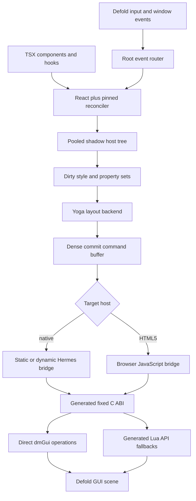

# Recommendation

Build `@ts-defold/react` as a real React custom renderer over Defold GUI. Use
React's mutation reconciler and ordinary React hooks, but never make an
individual reconciler mutation equal one JavaScript-to-engine call. Reconcile
into a small shadow tree, record a dense commit, calculate layout once, and
apply the commit to Defold in one bounded host call.

Use Yoga as the first layout backend. Its retained node tree fits React and
Defold's retained GUI model, it implements the familiar Flexbox contract, and
a historical Defold extension proves that Yoga can be built for every Defold
platform including HTML5. Integrate a pinned Yoga directly behind Deherm's
generated C ABI rather than depending on the old Lua wrapper. Keep the layout
interface replaceable and benchmark Clay as a second backend: Clay's fixed
arena and allocation-free frame model are attractive, but its immediate-mode
output is a less natural match for React and Defold's retained trees.[^layout]

Static Hermes is still the native release compiler. The initial compatibility
target is:

| Profile | Component runtime | Renderer host | Engine bridge |
| --- | --- | --- | --- |
| desktop/device development | React on dynamic Hermes | TypeScript/JavaScript | generated JSI plus dense C ABI commit |
| native release | React bundle compiled by Static Hermes | strict typed Static Hermes where accepted, untyped AOT unit where required | generated C ABI plus direct dmSDK/Lua fallback |
| HTML5 development/release | React in the browser host | ordinary bundled JavaScript | raw Emscripten C ABI into Defold Wasm |

The phrase “React bundle compiled by Static Hermes” is a validation target,
not a completed claim. Static Hermes documents native compilation of ordinary
JavaScript, while its sound typed language and TypeScript parser remain
explicitly partial and unstable. The exact pinned `react`, `react-reconciler`,
and `scheduler` artifacts must pass an AOT compile, link, boot, hooks, effect,
and teardown fixture before the release profile is advertised.[^static]

Preact remains a size experiment, not the first renderer. Preact exposes hooks,
a pluggable scheduler, and a much smaller runtime, but its public `render()`
contract is DOM-shaped and its option hooks observe or modify its renderer;
they are not a supported host configuration API. Replacing the DOM requires a
fork, a sufficiently complete fake DOM, or a new Preact renderer boundary.
React's reconciler is unstable, but it is the intended custom-host boundary
and has production precedents such as React Native and React Three Fiber.

# Proposed architecture



The renderer has four independently testable layers:

1. **React adapter** — the exact-version `HostConfig`, React root, hooks, event
   priorities, effects, DevTools connection, and Fast Refresh registration.
2. **Host model** — stable generational handles, pooled shadow nodes, prop
   diffing, child order, event registrations, layout style, and lifecycle.
3. **Commit compiler** — turns dirty host records and layout results into
   target-neutral opcodes and contiguous payload spans.
4. **Defold executor** — validates the buffer, mutates one GUI scene on its
   owning thread, and returns structured failures and counters.

Only the first layer should know about `react-reconciler`. Exact version churn
must not leak into the host model or C ABI. React itself warns that the package
is experimental, does not follow React's normal versioning, and has an
incomplete HostConfig reference. Pin the React/reconciler/scheduler triple
exactly and maintain a compile-time HostConfig conformance fixture for every
upgrade.[^reconciler]

# Why mutation mode

Defold GUI nodes have identity and are mutated in place. The reconciler's
mutation mode expresses create, append, insert, remove, text update, hide,
unhide, and property update directly. Persistence mode clones parents and
replaces whole trees; that would create extra transient records and work
against stable native handles. Hydration is unnecessary for the first release.

React's render phase must not touch Defold. `createInstance()` and
`appendInitialChild()` create and connect shadow records only. This also obeys
React's documented rule that render-phase instances may never be committed.
`prepareForCommit()` opens a commit frame and `resetAfterCommit()` seals and
flushes it. Mount-only effects such as focus are recorded in `commitMount()`,
not performed during render.[^reconciler]

```ts
type GuiHandle = Readonly<{
  slot: number;
  generation: number;
}>;

type HostNode = {
  handle: GuiHandle;
  kind: GuiKind;
  parent: number;
  firstChild: number;
  nextSibling: number;
  propBits: number;
  eventBits: number;
  layoutSlot: number;
};
```

The actual hot arrays should be structure-of-arrays storage rather than an
array of JavaScript objects. The object shape above explains the semantics.
Names, source paths, TSDoc, and React debug owners belong in cold development
metadata, not in the commit record.

# TypeScript authoring surface

Start with GUI-specific intrinsic elements and ordinary components. Do not
pretend that DOM elements exist.

```tsx
import { createGuiRoot, useDefoldFrame } from "@ts-defold/react";

function ScoreCard({ score }: { score: number }) {
  return (
    <box
      id="score-card"
      style={{
        flexDirection: "row",
        alignItems: "center",
        gap: 12,
        padding: 16,
      }}
      texture="#ui/card"
      onPointerDown={() => print("score pressed")}
    >
      <text font="#ui/body" color="#ffffff">
        {`Score: ${score}`}
      </text>
    </box>
  );
}

export function mountGui(scene: GuiScene) {
  return createGuiRoot(scene, { parent: "#react-root" }).render(<ScoreCard score={0} />);
}
```

The first intrinsic set should be deliberately small:

| Intrinsic | Native representation | Notes |
| --- | --- | --- |
| `box` | Defold box node | texture, color, slice-9, clipping, material |
| `text` | Defold text node | string children, font, wrapping, leading, tracking |
| `pie` | Defold pie node | fill angle, radii, perimeter, texture |
| `particle` | cloned/mapped particle-FX prototype | resource must be declared by the GUI scene |
| `node` | layout/transform group | use a transparent box only when a native node is required |
| `existing` | editor-authored node or cloned template | resolves a literal `#node-id`; never dynamically loads an undeclared resource |

Use literal-constrained Defold resource identifiers in props. The generator can
augment JSX intrinsic types from the project's `.gui`, atlas, font, material,
and particle dependencies. The same generated facts power completions and
diagnostics in the VS Code language server.

Do not make `style` a bag of arbitrary strings. It should be a generated,
closed type whose values lower to compact numeric enums and fixed-width layout
records. Development builds retain property names for diagnostics; release
builds retain numeric field IDs only.

# Defold constraints that shape the renderer

Defold GUI is not a browser DOM:

* A GUI is a component with its own scene and GUI-script lifecycle. GUI scripts
  have the `gui` namespace but not the `go` namespace, so scene/game-object
  operations cross an explicit renderer or message boundary.
* The GUI resource graph is static. Fonts, textures, materials, particle
  effects, and templates used at runtime must be declared in the GUI scene or
  otherwise packaged as project resources.
* A GUI scene has a configured maximum node count. Dynamic React mounts can
  exhaust it, so the renderer must expose capacity and high-water diagnostics
  and fail a whole commit deterministically instead of partially mounting.
* Defold can create, parent, mutate, pick, hide, and delete GUI nodes at
  runtime. Parent transforms affect descendants. Node enabled and visible
  states have different picking and animation behavior.
* Node order, type, texture/atlas, blend mode, font, clipping, and stencil
  scopes affect draw-call batching. JSX order and style changes can therefore
  have rendering cost beyond reconciliation cost.
* Display profiles and Defold layouts remain useful for scene resolution and
  orientation selection. They are not a replacement for a general runtime
  Flexbox tree because Defold layout variants override properties but cannot
  create or delete nodes.[^defold-gui]

The pinned public `dmGui` header exposes useful direct operations: create and
defer-delete nodes, set IDs and parents, iterate children, set common vector
properties, set textures, and read custom data. It does **not** expose the
entire Lua GUI surface: text/font/layer/clipping/animation and other conveniences
need generated Lua fallbacks or additional upstream-supported dmSDK entry
points. The executor should select direct dmGUI calls per opcode where the
public contract is sufficient and use cached Lua calls only for the missing
surface. Never call internal, non-dmSDK engine symbols merely to avoid
marshalling.[^dmgui]

# Commit buffer and hot-path policy

React reconciliation is not allocation-free. Elements, Fibers, hooks, and
component state are managed JavaScript objects. The realistic contract is:

* no React render is scheduled for an unchanged frame;
* structural renders may allocate in the JavaScript runtime;
* after warm-up, the host diff, layout bridge, command encoding, and native
  command application perform no general-heap allocation within configured
  capacity;
* continuous animation and physics values use transient frame subscriptions or
  Defold animation APIs rather than React state on every frame.

A commit buffer should use parallel typed spans and a byte/string arena:

```ts
type GuiCommit = Readonly<{
  opcodes: Uint16Array;
  targets: Uint32Array;
  argumentOffsets: Uint32Array;
  numbers: Float32Array;
  integers: Uint32Array;
  utf8: Uint8Array;
}>;
```

The representation is illustrative. Static Hermes typed-mode support for
typed arrays must be validated at the pinned revision before the strict unit
owns these arrays. An untyped AOT unit or fixed `c_ptr` ABI can own them until
then.

One React commit should ordinarily produce one host transition:

```text
dirty host slots
  -> stable opcode sort by dependency
  -> create nodes
  -> parent/order mutations
  -> style changes and one layout calculation
  -> transform/size changes
  -> visual/text/resource changes
  -> delete retired subtrees
  -> release callback and handle slots
```

The executor validates the complete buffer before applying it. Every opcode
contains a generational target handle; stale or cross-scene handles reject the
commit. Temporary UTF-8 strings and vectors live in one dispatch arena and may
not escape. Values retained by Defold are explicitly copied or promoted.

Pools may grow only at an explicit safe point, with project-configured mobile,
desktop, and web budgets. Growth allocates a replacement slab outside a commit
and records the event. “No heap in a hot path” must not become “reserve all
possible memory at boot.”

# Layout choice

## Yoga first

Yoga is the best default for the first conformance spike because:

* its retained tree maps one-to-one to host node lifetime;
* Flexbox semantics are known to React users;
* its C/C++ implementation can be linked into the Defold native extension and
  the same Defold HTML5 Wasm artifact;
* measure functions support Defold font metrics;
* an existing, though old, Defold Yoga extension demonstrates all target
  platforms and the required top-left versus bottom-left coordinate adapter.

Do not use the npm `yoga-layout` Wasm package inside native Hermes or add a
second Yoga Wasm instance beside Defold on HTML5. Bind the native Yoga C API
once through the Deherm extension. Create and destroy Yoga nodes explicitly;
JavaScript finalization cannot own correctness.

Text measure calls use `resource.get_text_metrics()` or a public equivalent,
keyed by font, UTF-8 content hash, width, leading, tracking, and line-break
mode. Cache results in a bounded LRU owned by the GUI root and invalidate on
font/resource reload. Batch cache misses; text measurement can dominate layout
if it crosses the Lua boundary one string at a time.

## Clay as a measured alternative

Clay is a serious second candidate, not a drop-in “better Yoga.” It is a small
single-header C library with no standard-library dependency, a caller-provided
fixed arena, no `malloc/free` in its layout path, visibility culling, explicit
string slices, and Wasm support. Those properties match Deherm's memory policy.

Its tradeoffs are equally material: Clay rebuilds a layout description each
frame and emits render commands, its model is Flexbox-like rather than a full
Flexbox implementation, and it does not own a retained Defold node tree. A
Clay backend would need to map stable Clay IDs back to React host handles and
diff its frame commands against retained GUI nodes. Benchmark it against Yoga
on menus, scroll lists, localized text, and orientation changes before choosing
it for production.[^layout]

The layout interface should therefore be narrow:

```ts
interface LayoutBackend {
  create(style: LayoutStyle): LayoutHandle;
  update(node: LayoutHandle, changed: LayoutFieldMask, style: LayoutStyle): void;
  insert(parent: LayoutHandle, child: LayoutHandle, index: number): void;
  remove(parent: LayoutHandle, child: LayoutHandle): void;
  measure(root: LayoutHandle, width: number, height: number): LayoutResultSpan;
  destroy(node: LayoutHandle): void;
}
```

# Input and events

The GUI bootstrap acquires Defold input focus and forwards `on_input()` actions
and window resize/focus events to one root router. Do not install a native or
Lua callback per node. Event handlers stay in the JavaScript host pool; native
state stores only event masks and stable handles.

The initial event algorithm is:

1. Normalize Defold actions into pointer, keyboard, text, gamepad, and custom
   action records without allocating a table per candidate.
2. Query only interactive candidates, in reverse paint order. Use
   `gui.pick_node()` or a proven direct equivalent for transformed bounds, then
   apply enabled, visible, clipping, pointer-events, and modal rules.
3. Reconstruct the host parent path and dispatch capture then bubble phases.
4. Map press/release and keyboard activation to `DiscreteEventPriority`, motion
   and scrolling to `ContinuousEventPriority`, and other updates to default
   priority.
5. Coalesce pointer motion and scroll input to at most one record per pointer
   per frame. Preserve every discrete press/release.

Pointer capture, focus order, keyboard/gamepad navigation, IME composition,
safe-area insets, and multi-touch identity are acceptance requirements, not
polish. Defold sends input only to focused script/GUI-script components, so the
root must release focus and all captures on unmount or application focus loss.

# Frame ownership and hooks

All GUI mutations occur on the Defold main/GUI thread. The development and
release hosts use the same ordering:

```text
Defold update(dt)
  -> ingest input/window/resource events
  -> run due host timers and microtasks
  -> let React perform scheduled work within the configured budget
  -> flush a completed commit atomically
  -> run layout/effects
  -> run transient frame subscribers
  -> return before Defold renders
```

Begin with synchronous commits. Concurrent rendering can be enabled only after
interruption, error recovery, Suspense hiding, and atomic commits are proven.
The HostConfig still provides Defold-backed timeout and microtask queues, a
monotonic clock, and current event priority. Never call GUI APIs from an
arbitrary Promise job after the owning update frame has ended.

The authoring target is ordinary React hooks. The compatibility gate must prove
each supported hook and effect lifecycle on every runtime profile. Add
engine-aware hooks with explicit lifetime:

```tsx
function Spinner() {
  const node = useRef<GuiNodeRef>(null);

  useDefoldFrame((dt) => {
    node.current?.rotateZ(dt * 90); // transient command, no setState
  });

  useDefoldMessage("#player", "health_changed", (message) => {
    // Event-driven state is appropriate here.
  });

  return <box ref={node} texture="#ui/spinner" />;
}
```

`useDefoldFrame` callbacks run from a dense subscription pool and append to a
preallocated transient command buffer. They do not run React reconciliation.
They must not create/delete nodes or retain scratch views. Continuous native
animation should prefer `gui.animate()` when that expresses the behavior.

# Static Hermes contract

React running on Hermes is well established through React Native, and current
React Native documentation identifies Hermes as its usual engine. This is good
evidence for dynamic-Hermes language/runtime compatibility; it does not prove
that a standalone React reconciler bundle, Deherm scheduler, and Defold host
work together.[^hermes-react]

Static Hermes has two distinct lanes:

1. **Untyped AOT JavaScript.** Static Hermes documents compiling the complete
   JavaScript language to native code and Wasm, retaining an interpreter for
   dynamic constructs when required. The first release spike should bundle
   production React and the renderer as ordinary JavaScript and compile that
   exact artifact to native code.
2. **Sound typed code.** The typed language is an unstable subset. TypeScript
   syntax is only partially accepted, and features used by arbitrary npm
   packages cannot be presumed compatible. New host-model, command-codec, and
   ABI modules should be authored in the strict subset and compiled as typed
   Static Hermes units when they pass. React core may remain an untyped AOT
   unit connected through a deliberately narrow boundary, provided the mixed
   unit/linking spike proves that boundary.

This still uses Static Hermes for the release application. It avoids the false
claim that every dependency is sound-typed on day one. The conformance report
must separately state `untyped-aot`, `typed-aot`, native-code coverage, and any
interpreter fallback for every retained package.

Do not use `FinalizationRegistry` to release GUI or Yoga nodes. The pinned
Hermes release includes it, which makes it useful for development diagnostics,
but TC39 explicitly says a conforming implementation may call cleanup much
later or not at all. React unmount, root disposal, and Defold `final()` are the
authoritative release path; finalizers may report a leaked owner or enqueue a
last-resort cleanup only while the runtime is alive.

# Browser parity

HTML5 runs React in the browser JavaScript host and calls the same generated
commit ABI exported by Defold's Emscripten module. It does not compile Hermes
into Wasm and it does not use `react-dom` for the game UI. This preserves the
same Defold GUI layout, batching, input, and rendering behavior across native
and browser targets.

Use an `ArrayBuffer` view into Wasm memory and one exported
`deherm_gui_apply_commit(root, ptr, byteLength)` call. Refresh views after Wasm
memory growth. Release builds export only opcodes and resources reachable from
the JSX graph. Browser development may retain human-readable diagnostics and a
command inspector.

A DOM-backed accessibility overlay can be an optional HTML5 adapter, but it
must consume the renderer's semantic tree rather than replace the visual host.
Native targets require separate platform accessibility extensions. No public
accessibility-semantics surface was found in the reviewed Defold GUI API, so
cross-platform screen-reader support is an open product requirement, not an
existing engine feature.

# Hot reload and tools

Development uses dynamic Hermes and a precompiled renderer extension. The
watcher bundles changed TypeScript and injects React Refresh signatures. React
Native documents that Fast Refresh can preserve function-component and hook
state when hook order remains compatible; mixed exports and unsafe edits fall
back to a wider reload. Deherm must reproduce and test that protocol rather
than equating Defold's resource reload with React Fast Refresh.[^refresh]

Defold's own hot reload re-executes a Lua script and calls `on_reload()` without
calling `init()`. The GUI bootstrap should therefore keep one durable root
owner, forward a module update into the React refresh runtime, and perform a
full root remount only when signatures or host schemas are incompatible.

Development-only tooling should include:

* the standalone React DevTools backend connected from the same Hermes context
  before React imports;
* a VS Code tree view showing components, host handles, Defold node IDs, layout
  rectangles, dirty flags, commit opcodes, and live allocation/high-water data;
* source-mapped component stacks and Defold resource diagnostics;
* a headless test renderer that snapshots the host graph and commit buffer
  without Defold, following the useful precedent of React Three Fiber's test
  renderer;
* an in-game overlay for layout bounds, clipping, hit regions, focus, and draw
  batch breaks.

Production builds remove Refresh, DevTools, component-owner strings, source
locations, inspector hooks, and unused intrinsic codecs through the existing
reachability pipeline.

# React Three Fiber-like frontier

Do not mix game objects into the first GUI HostConfig. Prove GUI first, then
add `@ts-defold/react-scene` as a sibling renderer sharing the host-model,
command-buffer, event, scheduler, and test infrastructure.

```tsx
function Level() {
  return (
    <collection path="#levels/forest">
      <gameObject id="player" position={[0, 2, 0]}>
        <sprite image="#hero/idle" />
        <collision shape="#hero/capsule" />
        <PlayerController />
      </gameObject>
      <guiPortal target="#hud">
        <HealthBar />
      </guiPortal>
    </collection>
  );
}
```

This is direction, not a promised API. Defold resources and collection
factories have lifecycle and static-dependency constraints that differ from
Three.js constructors. A scene renderer must declare whether each element is
an editor-owned instance, dynamically spawned factory, component proxy, or
pure logical component. It must never imply that arbitrary resources can be
created because a JSX tag appeared.

The useful React Three Fiber patterns to borrow are:

* exact React/reconciler version pairing;
* a small registered catalogue so unused host constructors tree-shake;
* refs exposing safe public host instances rather than React internals;
* a frame-subscription hook for transient updates outside reconciliation;
* portals across renderer roots;
* a headless graph test renderer;
* event priority and engine-owned render-loop integration.

Do not copy its Three-specific dynamic-property model or claims about overhead.
Defold's message passing, URL addressing, resource packaging, collection
factories, and Lua compatibility boundary require a separate semantic IR.

# Accessibility

JSX gives Deherm a place to describe semantics even though Defold GUI does not
provide a portable accessibility tree:

```tsx
<box
  role="button"
  accessibilityLabel="Continue"
  accessibilityState={{ disabled: false }}
  focusable
  onActivate={continueGame}
/>
```

The host model should retain a compact semantic tree separate from paint
nodes. Keyboard/gamepad focus and activation can be implemented portably in
Defold. Screen-reader output needs adapters:

* HTML5: a synchronized DOM semantic overlay with carefully tested focus and
  pointer behavior;
* iOS/macOS: native accessibility elements through a Defold extension;
* Android: native accessibility node/provider integration;
* desktop/console: platform-specific support or an explicitly documented
  capability gap.

Semantic props should ship early so applications do not need an API rewrite
later, but the project must not claim screen-reader conformance until each
adapter passes platform tests.

# Conformance spike

The first implementation wave should be one small game HUD, not a component
library. It is accepted only when all of these are reproducible:

1. **Headless renderer** — mount, keyed reorder, text update, prop removal,
   hide/unhide, error boundary, and unmount produce golden host graphs and
   command buffers.
2. **Defold GUI fixture** — a score card, button, localized wrapping text,
   scrollable list, modal, texture, and orientation change render correctly.
3. **Hooks** — state, reducer, context, ref, layout effect, effect cleanup,
   memo, transition behavior selected for the first release, and an error
   boundary pass on dynamic Hermes.
4. **Input** — mouse, touch, multi-touch, keyboard, gamepad, text/IME, capture,
   bubble, focus, modal blocking, resize, and focus loss have golden event
   traces.
5. **Static Hermes** — the exact production React/reconciler/scheduler bundle
   compiles, links, boots, updates, and tears down through Static Hermes. Typed
   and untyped units are reported separately.
6. **Browser** — the same fixture uses browser JavaScript plus the raw Wasm C
   ABI, with no Hermes Wasm payload and no `embind` dependency.
7. **Hot refresh** — a safe component edit preserves hook state; a changed hook
   order or host schema causes a clean remount; all effect and event cleanup is
   observed.
8. **Allocation** — an idle frame creates no React work and no host allocation;
   a warmed repeated prop update performs one host call and zero general native
   heap allocations; structural React allocations are measured and reported.
9. **Lifetime** — repeated mount/unmount, failed commit, root replacement,
   resource reload, and runtime shutdown pass ASan/LSan/UBSan where available;
   every Yoga node, callback, native handle, string promotion, and React root is
   released.
10. **Capacity** — node, command, UTF-8, layout, callback, and measure-cache
    exhaustion fail atomically with required size, capacity, high-water mark,
    scene, and component owner diagnostics.
11. **Visual parity** — native and HTML5 screenshots match within declared font
    and raster tolerances at landscape, portrait, high-DPI, and safe-area sizes.
12. **Package cost** — compressed bundle, native binary, startup, first commit,
    steady-state memory, GC, and frame-time distributions are reported for
    React, then compared with a small Preact/Clay experiment if the baseline is
    too costly.

# Evidence ledger

| Claim | Evidence | Disposition |
| --- | --- | --- |
| React exposes a custom-renderer boundary | React's own `react-reconciler` README defines HostConfig, mutation/persistence modes, commit hooks, timers, microtasks, and event priority | verified, but explicitly unstable |
| React hooks can run on Hermes | React Native normally runs React on Hermes | verified precedent, not yet a Deherm reproduction |
| The exact renderer bundle can ship as Static Hermes native code | Static Hermes documents AOT compilation of ordinary JavaScript | plausible; exact package graph must compile/link/run |
| The complete renderer can be strict typed Static Hermes immediately | Static Hermes calls the typed language unstable and TypeScript support partial | rejected as an unsupported assumption |
| Preact is automatically the easier native renderer | Preact's public renderer types are DOM-shaped; option hooks are extensions, not HostConfig | rejected for phase one |
| Yoga can run with Defold on all main targets | the historical Defold Yoga native extension lists desktop, mobile, and HTML5 | verified historical feasibility; current version/integration quality unverified |
| Clay matches the allocation policy | Clay documents caller-owned arena storage and no malloc/free in layout | verified design property; retained-tree integration and comparative performance unverified |
| The dmSDK GUI API covers the entire React host | pinned public header covers core nodes/properties but not the full Lua GUI API | false; generated fallback is required |
| Defold GUI can host runtime-created trees | official API exposes dynamic node creation, parenting, mutation, picking, and deletion | verified within scene capacity/resource constraints |
| Fast Refresh state preservation comes from Defold hot reload | the systems have distinct behavior and lifecycles | false; React Refresh integration is required |
| `FinalizationRegistry` makes native ownership safe | finalization is nondeterministic even though Hermes provides the API | false; explicit disposal remains authoritative |
| Browser parity requires Hermes compiled into Wasm | browser JavaScript can own React and call Defold's raw Wasm ABI | rejected; omit Hermes from HTML5 |

# Phased delivery

## Phase 0 — compatibility gate

Pin one React/reconciler/scheduler triple. Build a no-op host and prove hooks,
effects, DevTools injection, dynamic Hermes, Static Hermes AOT, and browser
execution. If production React cannot pass Static Hermes AOT, reduce and report
the exact compiler fixture before designing the Defold host around it.

## Phase 1 — GUI core

Implement `box`, `text`, and `existing`; synchronous mutation mode; pooled
handles; dense commit ABI; direct `dmGui` operations plus generated fallbacks;
input press/move/release; explicit teardown; and the headless test renderer.

## Phase 2 — layout and development experience

Add pinned Yoga, text measurement cache, resize/safe-area handling, Fast
Refresh, React DevTools, VS Code live tree/layout data, capacity diagnostics,
and native/browser visual parity fixtures.

## Phase 3 — complete GUI and accessibility semantics

Add pie, particle prototypes, clipping, materials, animation, portals,
scrolling, focus/navigation, IME, semantic props, and platform accessibility
adapters. Generate project-specific JSX resource literals and TSDoc.

## Phase 4 — scene renderer frontier

Only after GUI conformance, design the game-object/collection semantic IR and
build a sibling R3F-like renderer. Share infrastructure, not accidental GUI
semantics. Use a full example game to decide where declarative scene ownership
is genuinely better than ordinary TypeScript game logic.

# Open questions to resolve with code

* Which current React/reconciler/scheduler versions compile and execute on the
  pinned Static Hermes revision, and which constructs force interpreter paths?
* Which GUI operations can safely use public `dmGui` directly in an extension,
  and which must remain in the active GUI Lua context?
* Can Defold's font metrics be called directly through public dmSDK for a
  batched Yoga measure pass, or is a generated Lua batch the supported route?
* Does Yoga 3.2.1 build unchanged in every pinned Defold extension toolchain,
  including C++ standard requirements and consoles?
* What idle, structural-update, layout, and large-list costs does React add on
  representative low-end mobile devices compared with Preact and a smaller
  strict-Static-Hermes component runtime?
* Which subset of concurrent React is valuable in a deterministic game frame,
  and what frame budget/suspension semantics are acceptable?
* What accessibility APIs are available on each Defold platform without an
  engine fork?

[^reconciler]: React describes `react-reconciler` as experimental, documents mutation mode for mutable hosts, distinguishes render and commit phases, and exposes scheduler/event-priority hooks in its incomplete reference.
[^static]: Static Hermes at the pinned revision documents ordinary JavaScript AOT compilation, but its typed-language guide labels sound typing unstable and TypeScript parsing partial.
[^layout]: Yoga is an embeddable Flexbox engine with an existing Defold precedent. Clay uses a caller-supplied fixed arena and emits renderer-independent layout commands; that memory model does not by itself prove it is the better retained React layout backend.
[^defold-gui]: The official GUI, layout, input, API, and memory manuals document the separate GUI component model, static resources, dynamic node operations, capacity, picking, layout variants, and batching constraints.
[^dmgui]: The pinned `dmsdk/gui/gui.h` is the ground truth for supported native GUI calls. Its surface is materially smaller than the official Lua GUI API.
[^hermes-react]: React Native is strong ecosystem evidence because it normally executes React on Hermes; Deherm still owns a different scheduler, renderer, and native host and must reproduce compatibility.
[^refresh]: React Native's Fast Refresh documentation defines when function-component and hook state can be preserved. Defold hot reload re-executes scripts and invokes `on_reload()` without rerunning `init()`.
