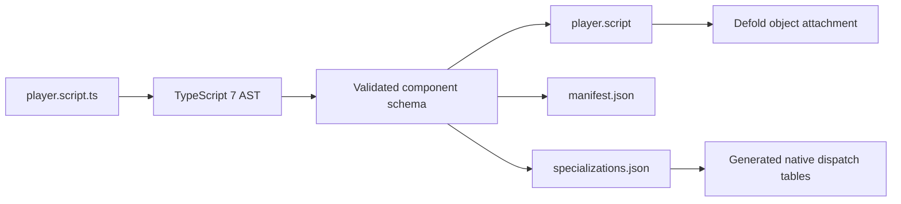

# Result

The first `.script.ts` proxy generator is mechanical and source-authoritative.
It parses the TypeScript AST supplied by TypeScript 7, accepts either an
explicit `export default defineComponent({...})` or
`export default component(NamedClass)`, and emits all artifacts from the same
normalized schema:

1. the sibling editor-facing `.script` resource with `go.property` declarations
   and lifecycle forwarding;
2. `.deherm/generated/components/manifest.json`, which records source and
   schema fingerprints, lifecycle availability, typed defaults, and provenance;
3. `.deherm/generated/components/specializations.json`, which records
   numeric lifecycle slots, property codec slots, and stable native symbols.

No component-specific file is authored by an agent or copied from a template by
hand. The committed player fixture and exact goldens exercise the generator,
but they are test inputs and outputs, not a second source of truth.

The named same-file class must directly extend its context base
(`ScriptComponent`, `GuiComponent`, or `RenderComponent`). Static literal
`properties` and prototype lifecycle methods normalize into the same schema as
the object form. The manifest and specialization record `authoringStyle` and
the class name while the Lua proxy and native dispatch ABI stay identical.

The shipped SDK adapter creates one class instance per runtime attachment,
copies editor property values before `init`, and invokes lifecycle methods with
that instance as `this`. Its private attachment field is non-enumerable. A new
definition in the same Hermes runtime captures new prototype methods while
retaining that instance and its fields. The executable adapter test verifies
constructor count, property copying, exact input return, non-enumerability, and
state continuity; this is JavaScript adapter evidence, not packaged-engine hot
reload evidence.



# Authoring subset

The object shape remains intentionally narrow:

```ts
export default defineComponent({
  properties: {
    speed: property.number(120),
    team: property.hash("blue"),
    spawn: property.vector3(1, 2, -3),
    tankAtlas: property.atlas("/assets/tanks.atlas"),
  },
  init(self: PlayerSelf): void {},
  update(self: PlayerSelf, dt: number): void {},
  final(self: PlayerSelf): void {},
  onMessage(self, messageId, message, sender): void {},
  onInput(self, actionId, action): boolean { return false; },
  onReload(self): void {},
});
```

Supported property codecs are number, boolean, string, hash, empty URL,
vector3, vector4, quaternion, atlas, buffer, font, material, render target,
texture, and tile source. Numeric, string, boolean, vector, and resource
defaults must be literals in the component definition. The empty URL rule
matches Defold's declaration-time `msg.url()` restriction. Expressions,
spreads, computed names, unknown members, unknown codecs, non-empty URL
defaults, and unsafe Lua field names fail generation. This is deliberate: the
generator never guesses a value by evaluating application code.

Class declarations additionally fail closed on class expressions, indirect or
context-incompatible base classes, required constructor arguments, static
lifecycle methods, and per-instance lifecycle arrow fields. Prototype methods
avoid one closure allocation per attached component.

The component ID is a namespaced full SHA-256 digest of the normalized,
project-relative `.script.ts` path. It stays stable when implementation or
property defaults change, differs for identical source at different paths, and
is collision-checked across the generation set. The schema fingerprint changes
when the lifecycle/property ABI changes. Paths and outputs are sorted, with
case-folded collision checks for cross-platform builds.

# Generated proxy contract

The generated Lua shim needs the `defold_hermes` Lua module to add these exact
methods before a generated component can execute:

| Method | Required behavior |
| --- | --- |
| `attachComponent(self, componentId, schemaFingerprint) -> boolean` | Validate the bundled registration and fingerprint; allocate or acquire one component instance; copy the ordered property slots from `self`; root the matching Hermes object; fail without partially attaching. |
| `dispatchLifecycle(self, componentId, phase, value?)` | Dispatch `init`, `update`, or `final` with the exact current Defold script instance restored. `update` receives `dt`. Unknown IDs/phases and stale instances fail closed. |
| `dispatchMessage(self, componentId, messageId, message, sender)` | Preserve Defold hash, URL, and message-table semantics and dispatch to `onMessage`. |
| `dispatchInput(self, componentId, actionId, action) -> boolean` | Dispatch to `onInput` and return its consumption result to Defold without truthiness coercion. |
| `dispatchReload(self, componentId)` | Preserve the attached instance handle, authored `self` properties, and existing per-instance TypeScript state; rebind executable callbacks in place, then dispatch `onReload` on that same instance. A migration hook may evolve state explicitly, but reload must never silently detach/recreate it. |
| `detachComponent(self, componentId)` | Idempotently invalidate the generation, release Hermes/Lua roots and pooled state, and make queued stale events fail closed. |

The manifest and specialization both encode the initial
`preserve-instance-state` reload policy. The generated `on_reload(self)` calls
only `dispatchReload`; it deliberately performs no detach or attach operation.

The shim always emits `init` because attachment must occur even when the
TypeScript component has no authored `init`. It always emits `final` so roots
are released; when an authored finalizer exists, the shim uses `pcall` and
detaches before rethrowing. Optional hot callbacks are omitted entirely when
the TypeScript definition does not contain them.

These Lua methods are a specified dependency, not current runtime evidence.
The generator does not add or claim their C++ implementation. Until the native
bridge implements and exercises this table in an actual Defold build, the proxy
lane is generated and testable but not runtime-conformant.

# Regeneration and checks

Generate every discovered project component:

```sh
node scripts/generate-component-proxies.mjs --project /path/to/project
```

Check that every expected proxy and metadata file is byte-for-byte fresh:

```sh
node scripts/generate-component-proxies.mjs --project /path/to/project --check
```

`--input relative/path.script.ts` can select explicit entries. `--output-root`
is useful for packaging and isolated verification. Discovery does not follow
symlinks and excludes dependencies, upstream checkouts, builds, distribution
directories, and generated state. A sibling `.script` without the Deherm
generator marker is user-owned and is never overwritten.

The focused test command is:

```sh
node --test tests/component-proxy-generator.test.mjs
```

# Remaining proof boundary

The next wave must implement the six Lua methods from the table, generate the
native registration table from `specializations.json`, and run at least two
instances through init/update/message/input/reload/final in both dynamic Hermes
and browser profiles. It must then add repeated create/destroy soak tests,
stale-handle rejection, exact property round trips, allocation counters, and
leak/sanitizer evidence. The current goldens prove deterministic translation;
they do not prove engine execution.
