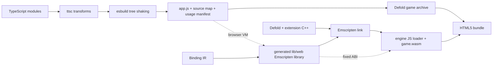
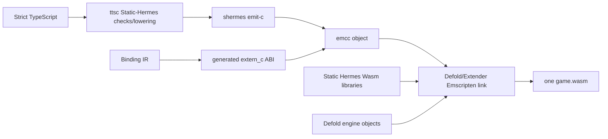

# Decision

Provide two HTML5 execution profiles behind the same generated TypeScript API
and conformance suite.

`browser-host` is the default. ttsc performs semantic transforms and esbuild
resolves, tree-shakes, and bundles the module graph as ordinary JavaScript. The
Defold engine remains one Emscripten-produced Wasm module. Generated Emscripten
JavaScript libraries expose direct, fixed-layout entry points between browser
JavaScript and that module. Hermes is not included.

`static-wasm` is an opt-in release experiment. Static Hermes emits C for the
strict application bundle, the matching Emscripten toolchain compiles it to an
object, and Extender links the object and required Static Hermes libraries into
the **same** Defold Wasm module. Generated `extern_c` imports then call the same
versioned C ABI used on native targets. Do not produce a second nested Hermes
Wasm VM or a second independently loaded application module unless isolation is
an explicit product requirement.

This is specifically the ordinary Defold extension path. The generated AOT C
unit is placed in the extension build payload, its Wasm-compatible Static Hermes
support archives are placed under `lib/wasm-web`, and the generated C++
`DM_DECLARE_EXTENSION` shell owns initialization and teardown. `shermes
-emit-c -exported-unit=deherm_app` produces a library-shaped `SHUnit` creator
named `sh_export_deherm_app` without a competing `main`; the shell creates the
runtime, calls `_sh_unit_init_guarded`, roots the registered lifecycle values,
and invokes them at Defold's safe lifecycle points. This exact exported-unit
shape was reproduced against the pinned compiler before recording the design.

# Default browser-host pipeline



The current build emits an ES2020 IIFE because the archived resource is loaded
synchronously by the extension. `game.project` includes
`/defold_hermes_app/app.js` as a custom resource. On initialization the HTML5
C++ extension reads those bytes with `dmResource::GetRaw`, then calls the linked
Emscripten library to install the generated modules and application lifecycle.
Extender discovers `.js` files under `lib/wasm-web` and the shared `lib/web`
directory automatically and passes them to Emscripten as `--js-library` inputs.

The current spike evaluates the archived IIFE. That is acceptable for proving
the bridge but is not the final production loader because strict Content
Security Policy may reject dynamic evaluation. The production browser-host
profile emits `app.<content-hash>.js` as an external bundle resource and adds a
deterministic script/module tag through Defold's HTML5 template merge. The app
registers `globalThis.__defoldAppV1`; the Wasm engine waits for that registration
before invoking `init`. Development can serve the same artifact from a local
server and replace a runtime generation without relinking the engine.

# Static Hermes fused-Wasm pipeline



Meta's checked-in helper proves the mechanical route: `shermes -emit-c`,
`emcc -c`, then link against the Emscripten-built Hermes libraries. It also
states that direct application-to-Wasm compilation is not yet a fully integrated
CLI path. Therefore this profile remains experimental until we reproduce it
with Defold's exact Emscripten version and link flags.

# Why browser-host remains the default

* It accepts the broadest TypeScript/npm/React surface and gives immediate
  browser DevTools, source maps, and fast refresh.
* TypeScript edits rebuild one JavaScript asset instead of a custom engine.
* It carries no second JavaScript runtime in the download or heap.
* Browser JIT versus Static Hermes Wasm performance is workload-dependent. The
  binding boundary can dominate engine-heavy code, while a browser JIT can win
  in JavaScript-heavy code.

The Static Hermes profile can win when a hot workload repeatedly crosses into
Defold: fusing generated code into the engine turns those calls into direct C
ABI calls inside one Wasm linear memory. It can lose through runtime/library
size, restricted language compatibility, GC/runtime costs, and slower builds.

# Shared ABI and memory policy

Both profiles consume the same binding IR and semantic overlay. Scalars use
direct calls. Struct arrays, transforms, vertices, messages, and other hot data
use generated structure-of-arrays or packed array-of-struct layouts in Wasm
memory. A frame scratch arena and generational handle tables eliminate
per-call allocation and stale-object reuse. Strings and variable payloads use
bounded UTF-8 scratch regions or explicit owned buffers. Embind, JSON, and
reflective name dispatch are forbidden on measured hot paths.

The browser-host adapter caches typed-array views and refreshes them only after
Wasm memory growth. The fused profile receives pointers directly. Both must
obey the same ownership, lifetime, bounds, and error contracts.

# Commands

The current local browser-host bundle path is:

```sh
npm run extender:prepare
npm run bob:web:bundle
```

`bob:web:bundle` selects `wasm-web`, generates the TypeScript bundle and web
bindings without packaging native Hermes archives, starts local Extender when
needed, and asks Bob to resolve, build, and bundle the game. The output is under
`build/bundle` according to the Bob wrapper configuration.

# Benchmark and promotion gates

Run browser-host and static-wasm from identical authored TypeScript and report:

1. compressed download size and Wasm/code split;
2. cold load, first frame, and time to interactive;
3. steady frame time distributions for JS-heavy and engine-call-heavy scenes;
4. JS heap, Wasm committed memory, peak memory, and growth events;
5. calls per frame and nanoseconds per scalar, handle, string, and bulk ABI call;
6. allocation counts after warm-up and callback/handle leak checks;
7. full API conformance results and retained npm/React compatibility;
8. incremental development build and release build duration.

Promote Static Hermes for HTML5 only when it wins a named release workload by a
material threshold without failing compatibility, size, memory, debugging, or
build-time budgets. Profile selection is per build, never an undocumented
semantic fork.
