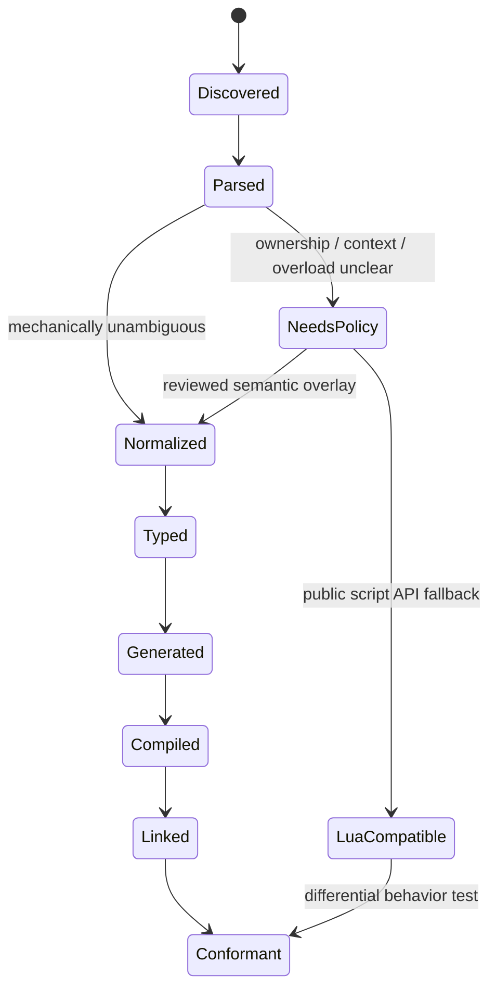

# Why examples own the design

The public TypeScript API should be reviewed as concrete code before generator
policy is frozen. These examples are proposed fixtures, not declarations that
the current runtime already implements. Once accepted, each fixture becomes a
golden generator test shared by the TypeScript, JSI, Static Hermes, Emscripten,
and Lua-compatible emitters.

# Per-symbol state machine

Every declaration advances independently. “Full API support” means no symbol
is silently dropped and the required target states are visible.



The ledger is actually target-dimensional. A function may be `conformant` via
Lua, `compiled` via dynamic JSI, and still `needs-policy` for Static Hermes or
HTML5. Release gates query required states instead of collapsing that truth to
one percentage.

# Example 1: a scalar native extension

Input C ABI:

```c
double xmath_dot3(const XMathVec3* left, const XMathVec3* right);
```

Reviewed IR:

```json
{
  "module": "xmath",
  "name": "dot",
  "symbol": "xmath_dot3",
  "thread": "engine",
  "parameters": [
    { "name": "left", "type": "Vec3", "borrow": "call" },
    { "name": "right", "type": "Vec3", "borrow": "call" }
  ],
  "returns": "f64"
}
```

Proposed idiomatic API:

```ts
import { xmath, vec3 } from "@defold-hermes/project";

const alignment = xmath.dot(vec3(1, 0, 0), vec3(0.5, 0.5, 0));
```

The dynamic JSI adapter reads two fixed-layout values and calls `xmath_dot3`
directly. Static Hermes emits one `extern_c` call. HTML5 writes the two vectors
into reusable generated scratch slots and calls one raw Wasm export. No target
uses JSON, reflection, or Embind.

# Example 2: current-instance sugar

Pinned Defold script input:

```lua
---@param id? string|hash|url defaults to the calling script instance
---@return vector3
function go.get_position(id) end
```

Literal compatibility API:

```ts
go.getPosition();
go.getPosition("player");
go.getPosition(hash("player"));
go.getPosition(msg.url("player"));
```

The zero-argument form is not equivalent to merely calling a similarly named
dmSDK function: it depends on the current component instance. The semantic
overlay therefore records `context: "script-instance"`. Initially it lowers to
the cached Lua compatibility thunk. A later direct implementation must pass the
same differential tests before replacing it.

An explicit-context alternative remains possible for systems code:

```ts
world.gameObject(player).position;
```

The recommendation is to offer both: `defold.script.go` preserves familiar
script sugar, while `defold.sdk.gameObject` exposes explicit handles and costs.

# Example 3: callback and generational lifetime

Pinned Defold script input:

```lua
timer.delay(delay, repeating, callback) -> timer_handle
```

Proposed TypeScript:

```ts
const timer = defold.timer.delay(0.25, { repeat: true }, ({ handle, elapsed }) => {
  if (elapsed > 5) handle.cancel();
});

timer.trigger();
timer.cancel();
```

The raw compatibility namespace remains one-to-one:

```ts
const handle = defold.raw.timer.delay(0.25, true, (self, handle, elapsed) => {});
defold.raw.timer.cancel(handle);
```

The ergonomic `Timer` is a branded generational handle, not a JavaScript-owned
engine object. It has explicit `cancel`/`dispose`; finalization only queues a
safe engine-thread release. Hot reload invalidates the runtime generation, so
an old callback can never enter the new realm.

# Example 4: completion callback and options object

Pinned script input:

```lua
sprite.play_flipbook(url, id, complete_function?, play_properties?)
```

Proposed TypeScript preserves Defold's operation but removes positional
optional-argument ambiguity:

```ts
sprite.playFlipbook("#hero", "run", {
  offset: 0,
  playbackRate: 1,
  onComplete(event) {
    console.log(event.sender, event.messageId);
  }
});
```

Raw compatibility remains available for exact ports. The ttsc transform lowers
the options object at compile time; generated target code sees fixed argument
slots and a rooted callback descriptor rather than a runtime options parser.

# Example 5: URL and hash values

Accepted direction: values are branded, compact, and explicit, while address
literals use template-literal types:

```ts
const animation = hash("run");
const spriteUrl = url("main:/player#sprite");

msg.post(spriteUrl, animation, { speed: 2 });
msg.post("#sprite", animation);
msg.post("main:/player#sprite", animation);
```

The compiler accepts structured literals such as `${string}#${string}`,
`/${string}`, and `${string}:${string}`, plus Defold's `"."` and `"#"`
shorthands. A bare relative id is valid Defold syntax but indistinguishable from
an arbitrary runtime string, so it is explicit:

```ts
go.getPosition(relativeAddress("player"));

// Type error: use relativeAddress("player") or a parsed Url.
go.getPosition("player");
```

`Hash` is represented as an opaque engine value, not an ordinary JavaScript
number. `Url` has a fixed native/Wasm layout. Literal constructors are
compile-time sugar where possible; dynamic strings hash or parse through a
generated intrinsic. Arbitrary message tables remain a slower compatibility
path until a typed message schema supplies a fixed codec.

# Example 6: engine-owned native handle

Input C++ often exposes an opaque pointer-like handle. The raw SDK must not make
that pointer look like a freely owned JavaScript object:

```ts
type ResourceFactory = BorrowedHandle<"dmResource.HFactory">;

function getResource<T extends ResourceType>(
  factory: ResourceFactory,
  path: ResourcePath<T>
): BorrowedResource<T>;
```

The overlay specifies owner, valid thread, nullable state, and invalidation
event. The wrapper stores a compact slot/generation, never the pointer in a JS
number. An owned handle instead implements explicit disposal and records its
native destructor.

# Example 7: third-party `.script_api` today

Given:

```yaml
- name: camera
  type: table
  members:
    - name: start
      type: function
      parameters:
        - { name: facing, type: string }
      return: { type: boolean }
```

The project generator already emits executable TypeScript source shaped like:

```ts
export const camera: CameraExtension = {
  start(facing: string): boolean {
    return callExtension("camera", "start", [facing]) as boolean;
  }
};
```

That body is the development compatibility path. The future ttsc plugin sees
the statically known module/member pair and can rewrite it to a generated direct
intrinsic when the extension contributes `defold-hermes.bindings.json`.

# Decisions to review with examples

The first API review should settle:

* camelCase ergonomic names plus a snake_case `raw` namespace, or one spelling;
* value objects versus readonly structural records for vectors, quaternions,
  hashes, and URLs;
* object handles with methods versus module functions accepting branded ids;
* thrown `DefoldError` versus `Result<T, E>` for expected engine failures;
* options objects versus overloads for Lua APIs with positional optional values;
* callback event objects versus preserving positional Lua callback arguments;
* how much implicit current-instance behavior belongs in the ergonomic layer.

No generator implementation should hard-code those choices before the golden
examples are accepted.
