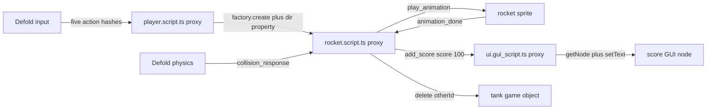

# Finding

The Defold editor does not install a completed War Battles game. At the pinned
Defold revision `7f0f554f41f9dce1e0ddff99bf08200657d1ee05`, its template catalog downloads
`defold/tutorial-war-battles` at
`a90dc4941de4b4a15551e0ccd89ccd6e2d35e20a`. That archive intentionally contains
the art, documentation, an empty `main.collection`, and the project shell so a
reader can build the game step by step. It contains no Lua script files and no
completed game-object, atlas, tilemap, or GUI resources.

The executable reference is therefore
`ts-defold/tsd-template-war-battles@a3e6b8d066110d8607bada4cc7f456eefc529218`.
It contains a completed copy of the tutorial project and three TypeScript files
that TypeScriptToLua emits as Defold scripts. We should use that repository as
behavioral migration evidence, not retain its TS-to-Lua architecture.

For imported Defold material, pin
`defold/tutorial-war-battles@645d9a1bc6c164237116e685694fca94021fc001`.
It differs from the editor-pinned revision only by the addition of the Defold
Foundation MIT license. Preserve that notice, the TSDefold MIT notice for code
adapted from its implementation, and the War Battles art credit to Luis Zuno.
The older `defold-examples` distribution points War Battles, including its
assets, at the Defold additional-materials terms; do not assume the TSDefold
repository's top-level MIT notice erases upstream attribution. This is a source
provenance rule, not legal advice.

# Verified baseline

| Concern | Source evidence | Baseline |
| --- | --- | --- |
| Project | `app/game.project` | 720x720, physics scale 0.02, shared Lua state, tile limit 100000 |
| World | `app/main/main.collection` | one map, one player, one GUI, four tank instances |
| Player | embedded game object | sprite, rocket factory, `/scripts/player.script` |
| Rocket | `app/main/rocket.go` | script, sprite, kinematic collision; group `rockets`, mask `tanks` |
| Tank | `app/main/tank.go` | sprite, kinematic collision; group `tanks`, mask `rockets` |
| GUI | `app/main/ui.gui` | one `score` text node driven by `/scripts/ui.gui_script` |
| Input | `app/input/game.input_binding` | arrow keys plus space mapped to `up`, `down`, `left`, `right`, `fire` |
| Animation | `app/main/sprites.atlas` | player walk, rocket, once-forward explosion, tank idle |
| Gameplay source | `src/scripts` | player, rocket, and GUI TypeScript files; 129 physical lines total |
| Third-party extension | `app/game.project` | `defold-lldebugger` is declared but never imported or called by gameplay |

The two source trees contain 304 byte-identical portable asset files. The only
extra tutorial asset is `.DS_Store`. A normalized sorted SHA-256 manifest of
the 304 portable files hashes to
`bd67f1db8fcf509ac108418bcd8941f0a7a0453f6cad0696d8c000564633403d`.
No sound component, particlefx component, custom render script, collection
proxy, or gameplay native extension exists in the baseline.

# Runtime flow



The reference lifecycle surface is exact:

* player: `init`, `final`, `update`, `on_input`;
* rocket: `init`, `update`, `on_message`;
* GUI: `init`, `on_message`.

The player acquires input focus, accumulates a direction vector, updates its
position, and spawns a rocket with a `dir` property. The rocket moves until its
one-second lifetime expires or physics sends `collision_response`. It stops,
resets rotation, requests the once-forward explosion animation, deletes a hit
tank, and posts `{ score: 100 }` to `/gui#ui`. `animation_done` deletes the
rocket. The GUI updates the `score` node.

# Exact API demand

The executable TSDefold reference directly requires 15 generated Defold API
functions, `Math.atan2`, vector arithmetic lowering, four address forms, six
message contracts, and five input hashes. The complete machine-readable list is
[`knowledge/data/war-battles-api-usage.json`](../data/war-battles-api-usage.json).

| Family | Required calls | Deherm consequence |
| --- | --- | --- |
| address/message | `hash`, `msg.post` | literal hashes should fold at build time; typed messages need exact payload and sender semantics |
| game object | `go.getPosition`, `go.setPosition`, `go.setRotation`, `go.delete` | current-instance and explicit-id forms must agree with Lua |
| factory/property | `factory.create`, generated `go.property` | spawned vector property must reach the correct Hermes component instance |
| values/math | `vmath.vector3`, `length`, `normalize`, `quat`, `quatRotationZ` | fixed layouts and overload selection; no boxed value churn on update |
| GUI | `gui.getNode`, `gui.setText` | requires a GUI-scene instance, not an ordinary game-object script instance |

The tutorial prose uses `sprite.play_flipbook`; the current TSDefold reference
uses the equivalent component message
`msg.post("#sprite", "play_animation", { id: hash("explosion") })`. Defold's
generated API source documents that the latter sends `animation_done` back to
the sender for once-only playback. The faithful port may choose either route,
but its differential trace must match.

Every listed generated API currently has `runtimeStatus` set to
`requires-universal-lua-bridge`; none has an entry in the generated scalar
dispatch table. Generated declarations are therefore not evidence that this
consumer runs. War Battles is a deliberately useful next tier because its
small API set exercises non-scalar values, tables, borrowed GUI handles,
overloads, engine messages, current-instance behavior, and a spawned property.

# Proxy port map

The following is an illustrative contract for the existing
`defineComponent` decision, not a claim that these imports already exist:

```ts
export default defineComponent({
  properties: {
    dir: property.vector3([0, 0, 0]),
  },
  init(self) {
    self.speed = 200;
    self.life = 1;
  },
  update(self, dt) {
    "use math";
    go.setPosition(go.getPosition() + self.dir * self.speed * dt);
  },
  onMessage(self, messageId, message, sender) {},
});
```

For `rocket.script.ts`, generation must put
`go.property("dir", vmath.vector3())` at resource-load scope in the sibling
`rocket.script`; it is not a normal runtime bridge call. `factory.create` must
encode the typed property table, while proxy initialization must transfer the
Lua-side property into the exact generation-keyed Hermes instance before
calling `init`.

For `player.script.ts`, the sibling `player.script` forwards input and frame
lifecycle events and restores the exact current script instance for fallbacks.
Literal `"."`, `"#rocketfactory"`, and action names become validated address
or prehashed constants. The eventual `"use math"` transformer may retain the
tutorial's readable vector operators; until its checker and runtime parity are
proven, the port must use explicit generated vmath operations.

For `ui.gui_script.ts`, an ordinary `.script` proxy is insufficient:
`gui.get_node` requires GUI-script context. The generator needs a sibling
`.gui_script` proxy with a separate component kind, lifecycle mask, instance
capture path, and GUI-scene handle. The Defold `.gui` resource continues to
reference that generated file, while VS Code opens the TypeScript source.

Suggested generated layout:

```text
war-battles/
  src/player.script.ts
  src/rocket.script.ts
  src/ui.gui_script.ts
  src/player.script             generated; editor-facing
  src/rocket.script             generated; editor-facing
  src/ui.gui_script             generated; editor-facing
  .deherm/generated/components.json
  .deherm/generated/messages.json
  .deherm/generated/war-battles.usage.json
```

The manifest should contain stable component ids, source and schema hashes,
lifecycle bits, property codecs, context kind, used API stable ids, message
schemas, input hashes, and target availability. Generation must refuse to
overwrite a proxy without its marker and check mode must reject stale files.

# First implementation slices

1. **Proxy fixture:** generate and attach a zero-property `.script.ts`
   component; prove two instances have isolated state across dynamic Hermes,
   strict Static Hermes, and browser-host builds.
2. **Rocket property fixture:** generate `dir`, spawn through `factory.create`,
   and compare the received vector and lifecycle order with the Lua oracle.
3. **Movement fixture:** wire fixed-layout vector construction, position
   get/set, length, normalize, quaternion construction, and rotation. Run a
   deterministic input timeline and compare positions per frame.
4. **Message fixture:** prove engine messages, custom payloads, typed address
   literals, sender URLs, and `animation_done` ordering without heap allocation
   after warm-up.
5. **GUI fixture:** generate a `.gui_script.ts` proxy, capture the correct GUI
   scene, and update one text node from a typed custom message.
6. **Faithful game:** import the pinned resources and run the complete original
   scenario. Only after state traces match should the over-the-top expansion
   begin.

# Acceptance trace

The first deterministic scenario should record engine-observed state rather
than screenshots:

1. create player and GUI proxies;
2. acquire input focus;
3. send `up` plus `right` for a fixed frame sequence;
4. assert normalized movement and exact final position;
5. press `fire` once and assert one rocket plus its `dir` property;
6. collide that rocket with a known tank;
7. assert tank deletion, one `add_score`, score `100`, explosion start, one
   `animation_done`, and rocket destruction;
8. destroy the collection and assert every Hermes/Lua root and handle returns
   to its pre-scenario count.

Repeat the trace for dynamic Hermes, strict Static Hermes, and browser-host
JavaScript. Compare lifecycle/message/property sequences and authoritative
positions. Run create/destroy loops under ASan/UBSan and allocator counters;
warm update, input, collision, and GUI-message paths must stay within declared
allocation budgets. `factory.create` intentionally creates an engine object,
so report that engine allocation separately from avoidable bridge, payload,
hash, or value-wrapper churn.

# Blocking gaps

* The `.script.ts` proxy generator and batched lifecycle executor remain a
  design, not a runnable product surface.
* `.gui_script.ts` is absent from the current component decision and must be a
  first-class generated context for a 100% TypeScript faithful port.
* All 15 directly used Defold functions are generated as types but remain
  outside the executable scalar bridge. The value/table/handle families must
  be implemented and real-engine observed.
* `factory.create` plus `go.property` is the critical instance/property
  handshake; a global module singleton cannot implement it correctly.
* Custom message payload typing and underscore-to-camel decoding must be
  generated from explicit schemas, not guessed at runtime.
* The `"use math"` vector-operator transform is not yet available; operator
  syntax in the old TSDefold source depends on TypeScriptToLua userdata sugar.
* Strict Static Hermes needs a sound `Math.atan2` standard-library declaration
  for this consumer; replacing it with Lua `math.atan2` would hide that gap.
* The reference's `defold-lldebugger` extension is unused by gameplay and
  should be removed. Deherm's Hermes debugger must be tested independently.
* Raw asset import must carry the Defold MIT notice and upstream credit; keep
  the recorded hash manifest so later asset changes are reviewable.

These are port gates, not reasons to hand-write per-game bridge functions. A
War Battles fix belongs in generator patterns or reusable runtime families and
must improve the global conformance ledger.
